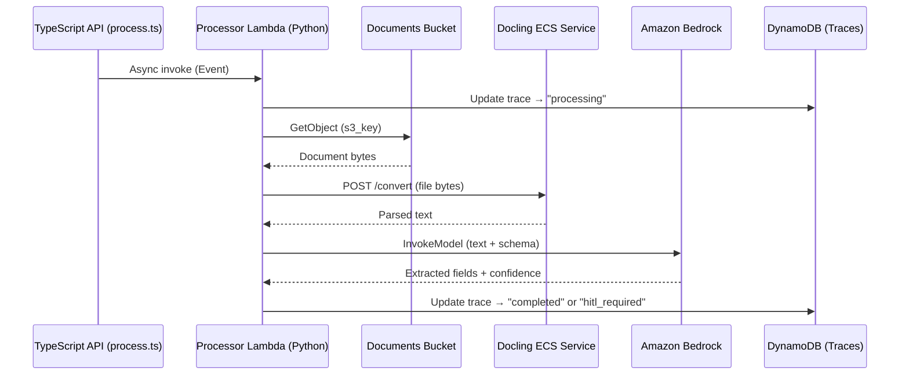
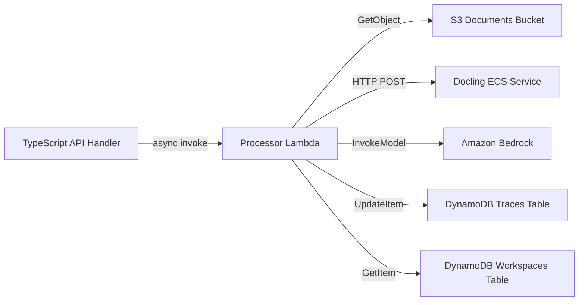

# Design Document: Document Processing Pipeline

## Overview

This design covers the Phase 2 document processing pipeline for the DocOps platform. The pipeline is an asynchronous Python Lambda (`docops-processor`) that receives invocation events from the existing TypeScript API handler (`process.ts`), orchestrates document parsing via the Docling ECS service, extracts structured fields using Amazon Bedrock, computes confidence scores, and updates DynamoDB trace records with results.

The pipeline follows a linear orchestration pattern:



Key design decisions:
- **Linear pipeline, no step functions**: The processing steps are sequential and complete within Lambda's 120s timeout. Step Functions would add latency and cost without benefit.
- **Thin client wrappers**: Docling and Bedrock interactions are isolated into separate service modules for testability and separation of concerns.
- **Fail-fast with trace updates**: Any failure at any stage immediately updates the trace to "failed" with an error message, so traces never remain in an indeterminate state.

## Architecture

### System Context

The processor Lambda sits between the API layer and external services:



### Module Structure

```
services/
├── processor/
│   └── __init__.py          # Lambda handler + orchestration logic
├── docling-client/
│   └── __init__.py          # HTTP client for Docling ECS service
├── llm-reasoning/
│   └── __init__.py          # Bedrock InvokeModel wrapper
└── models.py                # Shared Pydantic models (existing)
```

All three Python modules are bundled into a single Lambda deployment package. The processor module imports from docling-client and llm-reasoning as local packages.

### Deployment

The existing `ProcessingStack` CDK stack already provisions:
- S3 bucket with `raw/` prefix lifecycle (30-day expiry)
- Python 3.11 Lambda with 1024 MB memory, 120s timeout
- IAM permissions for DynamoDB (traces RW, workspaces R), S3 (RW), Bedrock (InvokeModel)
- Environment variables: `TRACES_TABLE`, `WORKSPACES_TABLE`, `DOCUMENTS_BUCKET`, `DOCLING_SERVICE_URL`, `BEDROCK_MODEL_ID`

The CDK handler path needs updating from `workflow.handler.handler` to `processor.handler` to match the actual module structure.

## Components and Interfaces

### 1. Processor Lambda Handler (`services/processor/__init__.py`)

Entry point for the Lambda. Receives the event payload and orchestrates the pipeline.

```python
def handler(event: dict, context: Any) -> dict:
    """
    Lambda handler. Event payload:
    {
        "trace_id": str,
        "workspace_id": str,
        "s3_key": str,
        "filename": str,
        "schema": dict,          # workspace extraction schema
        "hitl_threshold": float,  # 0.0–1.0
        "prompt_version": str
    }
    Returns: {"status": "completed" | "hitl_required" | "failed"}
    """
```

Orchestration steps:
1. Parse and validate event using Pydantic `ProcessingEvent` model
2. Update trace status → `"processing"`
3. Download document bytes from S3
4. Call `docling_client.parse_document(file_bytes, filename)` → parsed text
5. Call `llm_reasoning.extract_fields(parsed_text, schema)` → `ExtractionResult`
6. Compute overall confidence = mean of per-field confidences (or 1.0 if no fields)
7. Determine final status based on confidence vs. threshold
8. Update trace with results (fields, confidence, tokens, latency, status)

Error handling: top-level try/except catches all exceptions, updates trace to "failed".

### 2. Docling Client (`services/docling-client/__init__.py`)

HTTP client that sends documents to the existing Docling ECS service for parsing.

```python
class DoclingClient:
    def __init__(self, service_url: str | None = None, timeout: float = 60.0):
        """Initialize with Docling service URL (defaults to DOCLING_SERVICE_URL env var)."""

    def parse_document(self, file_bytes: bytes, filename: str) -> str:
        """
        Send document to Docling for parsing.
        Returns: parsed text content with page boundaries preserved as "--- Page N ---" markers.
        Raises: DoclingError on HTTP errors, DoclingTimeoutError on timeout.
        """
```

Implementation details:
- Uses `httpx` (already available in the Lambda environment) for HTTP requests
- Sends multipart/form-data POST to `{service_url}/convert`
- Extracts text from response JSON, concatenating page-level content with page boundary markers
- 60-second timeout (configurable)

### 3. LLM Reasoning Service (`services/llm-reasoning/__init__.py`)

Wrapper around Amazon Bedrock InvokeModel for structured field extraction.

```python
class LLMReasoningService:
    def __init__(self, model_id: str | None = None, region: str | None = None):
        """Initialize with Bedrock model ID (defaults to BEDROCK_MODEL_ID env var)."""

    def extract_fields(self, parsed_text: str, schema: dict) -> ExtractionResult:
        """
        Extract structured fields from parsed text using the workspace schema.
        Returns: ExtractionResult with fields list and token counts.
        Raises: LLMError on Bedrock API errors, LLMParsingError on invalid JSON response.
        """
```

Prompt construction:
- System prompt instructs the LLM to extract fields and return JSON
- User prompt contains the parsed document text and the schema fields (name, type, description)
- Response format: `{"fields": [{"field_name": str, "value": any, "confidence": float}]}`

### 4. DynamoDB Trace Updates

The processor uses `boto3` DynamoDB `update_item` to modify trace records. This preserves existing attributes (tenant_id, workspace_id, created_at, s3_key, filename) while adding processing results.

Update operations:
- **Start processing**: set `status = "processing"`
- **Success**: set `status`, `fields`, `confidence`, `tokens`, `latency`, `prompt_version`
- **Failure**: set `status = "failed"`, `error`

### 5. API Trace Retrieval (existing, minimal changes)

The existing `handleGetTrace` and `handleListTraces` handlers in `api/src/handlers/traces.ts` already return the full trace record from DynamoDB. Since the processor writes new attributes (`fields`, `confidence`, `tokens`, `latency`, `error`) directly to the trace item, these are automatically included in API responses without code changes.

The TypeScript `Trace` interface in `traces.ts` already includes optional `fields`, `confidence`, `tokens`, `latency`, and `error` properties.

## Data Models

### Processing Event (Lambda input)

```python
class ProcessingEvent(BaseModel):
    trace_id: str
    workspace_id: str
    s3_key: str
    filename: str
    schema: dict[str, Any] = Field(default_factory=dict)
    hitl_threshold: float = 0.8
    prompt_version: str = "1.0.0"
```

### Extraction Result (LLM output)

```python
class ExtractedField(BaseModel):
    field_name: str
    value: Any
    confidence: float = Field(ge=0.0, le=1.0)

class ExtractionResult(BaseModel):
    fields: list[ExtractedField]
    input_tokens: int
    output_tokens: int
```

### Trace Record (DynamoDB — after processing)

After processing, the trace record in DynamoDB contains these additional attributes beyond what was set at creation:

| Attribute | Type | Description |
|-----------|------|-------------|
| `status` | String | `"completed"`, `"hitl_required"`, or `"failed"` |
| `fields` | List[Map] | `[{"field_name": str, "value": any, "confidence": float}]` |
| `confidence` | Number | Overall confidence score (0.0–1.0) |
| `tokens` | Number | Total tokens used (input + output) |
| `latency` | Number | Processing time in milliseconds |
| `prompt_version` | String | Version from event payload |
| `error` | String | Error message (only on failure) |

### Workspace Schema Format

The workspace `schema` field defines extraction targets:

```json
{
  "fields": [
    {
      "name": "invoice_number",
      "type": "string",
      "description": "The invoice or document reference number"
    },
    {
      "name": "total_amount",
      "type": "number",
      "description": "The total monetary amount on the document"
    }
  ]
}
```


## Correctness Properties

*A property is a characteristic or behavior that should hold true across all valid executions of a system — essentially, a formal statement about what the system should do. Properties serve as the bridge between human-readable specifications and machine-verifiable correctness guarantees.*

### Property 1: Confidence score is the arithmetic mean of per-field scores

*For any* list of `ExtractedField` objects with confidence values between 0.0 and 1.0, the computed overall confidence score should equal the arithmetic mean of all per-field confidence scores (within floating-point tolerance).

**Validates: Requirements 1.5, 5.1**

### Property 2: Status determination follows confidence-threshold comparison

*For any* overall confidence score and HITL threshold (both between 0.0 and 1.0), if confidence >= threshold then the resulting trace status should be "completed", and if confidence < threshold then the resulting trace status should be "hitl_required".

**Validates: Requirements 1.6, 1.7, 5.2, 5.3**

### Property 3: Any processing exception results in a failed trace

*For any* exception raised during any stage of the processing pipeline (S3 download, Docling parsing, LLM extraction), the handler should catch the exception and update the trace record with status "failed" and an error message containing relevant failure details.

**Validates: Requirements 1.8, 8.1**

### Property 4: Docling client extracts text with page boundaries preserved

*For any* valid Docling service response containing page-level data, the `parse_document` method should return a string that contains the text content from every page, with page boundary markers separating each page's content.

**Validates: Requirements 3.2, 3.3**

### Property 5: Docling client propagates HTTP errors as exceptions

*For any* HTTP error status code (4xx or 5xx) returned by the Docling service, the `parse_document` method should raise a `DoclingError` exception whose message contains both the HTTP status code and the response body.

**Validates: Requirements 3.4**

### Property 6: Prompt includes all schema fields with name, type, and description

*For any* workspace schema containing one or more field definitions, the constructed LLM prompt should contain every field's name, expected type, and description from the schema.

**Validates: Requirements 4.1, 4.2, 4.3**

### Property 7: Bedrock response parsing extracts fields and token counts

*For any* valid Bedrock API response containing a JSON body with field values, confidence scores, and usage metadata, the `extract_fields` method should return an `ExtractionResult` where every field from the response is present with its value and confidence, and the token counts match the response metadata.

**Validates: Requirements 4.5, 4.6**

### Property 8: Invalid LLM JSON raises parsing exception with raw output

*For any* Bedrock response body that is not valid JSON or does not contain the expected field structure (a "fields" array with field_name, value, and confidence), the `extract_fields` method should raise an `LLMParsingError` whose message contains the raw LLM output text.

**Validates: Requirements 4.8**

### Property 9: Successful trace update contains all required attributes

*For any* successful processing run (status "completed" or "hitl_required"), the trace update should include: fields (list of objects with field_name, value, confidence), overall confidence score, total token count (input + output), processing latency in milliseconds (positive number), and prompt_version matching the event payload.

**Validates: Requirements 6.1, 6.2, 6.3, 6.4, 5.4**

### Property 10: Trace updates preserve existing attributes

*For any* trace record with pre-existing attributes (trace_id, workspace_id, tenant_id, s3_key, filename, created_at), after the processor updates the trace with processing results, all pre-existing attributes should remain unchanged on the record.

**Validates: Requirements 6.5**

## Error Handling

### Error Categories

| Error Type | Source | Trace Status | Error Message Pattern |
|-----------|--------|-------------|----------------------|
| `S3 download failure` | boto3 S3 GetObject | `"failed"` | `"S3 download failed: {error}"` |
| `DoclingError` | Docling HTTP error | `"failed"` | `"Docling service error: HTTP {status} - {body}"` |
| `DoclingTimeoutError` | Docling 60s timeout | `"failed"` | `"Docling service timed out after 60s"` |
| `LLMError` | Bedrock API error | `"failed"` | `"Bedrock API error: {error_type} - {message}"` |
| `LLMParsingError` | Invalid LLM JSON | `"failed"` | `"Failed to parse LLM response: {raw_output[:500]}"` |
| `ValidationError` | Invalid event payload | `"failed"` | `"Invalid event payload: {validation_errors}"` |
| `Unhandled exception` | Any unexpected error | `"failed"` | `"Unexpected error: {exception_message}"` |

### Error Handling Strategy

```python
def handler(event, context):
    trace_id = event.get("trace_id")
    start_time = time.time()
    try:
        # ... pipeline steps ...
    except Exception as e:
        try:
            update_trace_failed(trace_id, str(e))
        except Exception as update_err:
            logger.error(f"Original error: {e}")
            logger.error(f"Failed to update trace: {update_err}")
        return {"status": "failed"}
```

Key principles:
- The `trace_id` and `start_time` are extracted before the try block so they're available in error handling
- The outer try/except catches all exceptions and attempts to update the trace to "failed"
- If the trace update itself fails (double-fault), both errors are logged to CloudWatch
- Custom exception classes (`DoclingError`, `DoclingTimeoutError`, `LLMError`, `LLMParsingError`) provide structured error information

### Retry Policy

No application-level retries are implemented in Phase 2. The Lambda is invoked asynchronously (`InvocationType: 'Event'`), so AWS Lambda's built-in retry policy (2 retries for async invocations) provides basic resilience. The handler is idempotent — re-processing the same trace_id simply overwrites the trace record with fresh results.

## Testing Strategy

### Property-Based Testing

Property-based tests use `hypothesis` (Python PBT library) to verify universal properties across randomly generated inputs. Each property test runs a minimum of 100 iterations.

Each property test must be tagged with a comment referencing the design property:
```python
# Feature: document-processing-pipeline, Property 1: Confidence score is the arithmetic mean of per-field scores
```

Properties to implement as PBT:
- **Property 1**: Generate random lists of floats in [0.0, 1.0], verify mean computation
- **Property 2**: Generate random (confidence, threshold) pairs, verify status determination
- **Property 3**: Mock pipeline stages to raise random exceptions, verify trace ends as "failed"
- **Property 4**: Generate random Docling response JSON with varying page counts, verify text extraction
- **Property 5**: Generate random HTTP error status codes and bodies, verify exception content
- **Property 6**: Generate random schemas with varying field counts, verify prompt contains all fields
- **Property 7**: Generate random Bedrock response JSON with fields and token counts, verify parsing
- **Property 8**: Generate random non-JSON strings and malformed JSON, verify exception with raw output
- **Property 9**: Generate random extraction results, verify all attributes present in trace update
- **Property 10**: Generate random pre-existing trace attributes, verify they survive an update

### Unit Testing

Unit tests cover specific examples, edge cases, and integration points:

- **Edge cases**:
  - Empty schema (0 fields) → confidence = 1.0, status = "completed" (Req 5.5)
  - S3 download failure → trace status "failed" (Req 2.3)
  - Docling timeout → trace status "failed" with timeout message (Req 8.4)
  - LLM parsing failure → trace status "failed" with parsing message (Req 8.5)
  - Double-fault: trace update fails during error handling → both errors logged (Req 8.2)

- **Examples**:
  - Docling client reads URL from `DOCLING_SERVICE_URL` env var (Req 3.6)
  - Docling client timeout is 60 seconds (Req 3.5)
  - LLM service reads model ID from `BEDROCK_MODEL_ID` env var (Req 4.4)
  - GET /v1/traces/:trace_id returns full trace with extracted fields (Req 7.1)
  - GET /v1/workspaces/:id/traces returns traces sorted descending (Req 7.2)
  - Tenant ownership check on trace retrieval (Req 7.3)

### Test Organization

```
tests/
├── test_processor.py          # Handler orchestration tests (unit + property)
├── test_docling_client.py     # Docling client tests (unit + property)
├── test_llm_reasoning.py      # LLM reasoning service tests (unit + property)
├── test_confidence.py         # Confidence scoring tests (property)
└── test_trace_updates.py      # Trace update tests (unit + property)
```

### Dependencies

- `hypothesis` — property-based testing library for Python
- `pytest` — test runner
- `moto` — AWS service mocking (S3, DynamoDB, Bedrock)
- `respx` or `pytest-httpx` — HTTP mocking for Docling client tests
