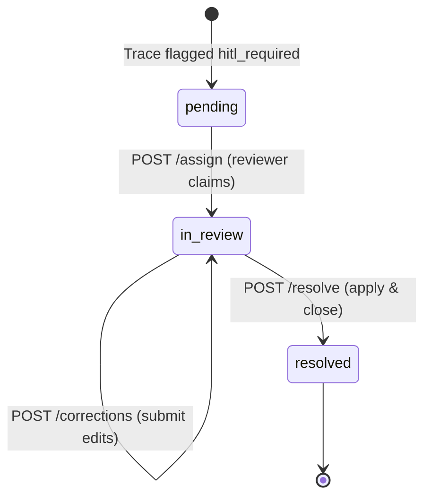
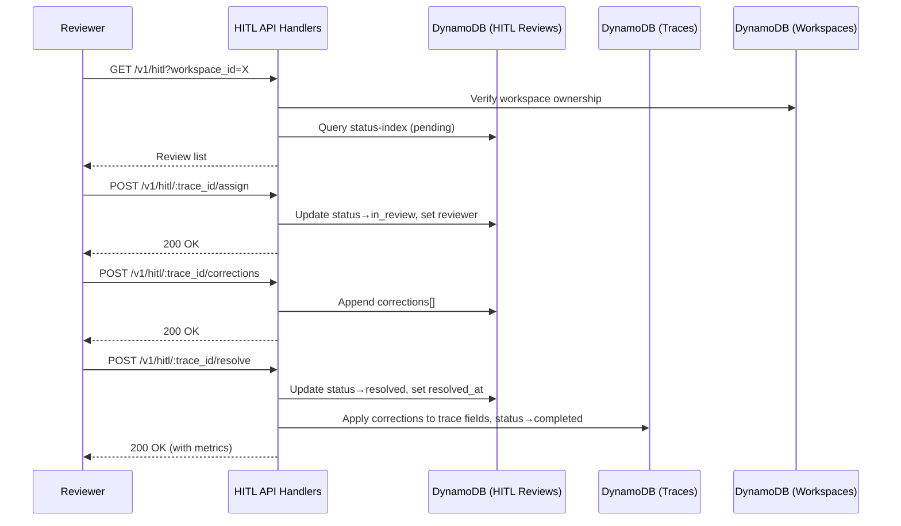

# Design Document: HITL Review System

## Overview

This design covers Phase 4 of the DocOps platform: the Human-in-the-Loop (HITL) review system. The system provides API endpoints for human reviewers to inspect, correct, and approve document extraction results that were flagged with low confidence during processing.

The HITL review lifecycle:



Key design decisions:
- **Review records are 1:1 with traces**: Each `hitl_required` trace gets exactly one Review_Record keyed by `trace_id`. No separate review_id needed.
- **Corrections are append-only**: Multiple correction submissions accumulate on the review. On resolution, all corrections are applied to the trace.
- **Optimistic resolution with rollback**: The resolve endpoint updates both the review and trace in sequence. If the trace update fails, the review status is reverted to `in_review`.
- **Workspace-scoped access**: All endpoints verify tenant ownership by looking up the trace's workspace and checking tenant_id against the JWT.



## Architecture

### Module Structure

All HITL functionality lives in the existing TypeScript API layer:

```
api/src/
├── handlers/
│   ├── hitl.ts              # NEW: All HITL review endpoint handlers
│   ├── health.ts
│   ├── process.ts
│   ├── traces.ts
│   └── workspace.ts
├── lib/
│   └── dynamo.ts            # Existing: add updateItem helper
├── middleware/
│   ├── auth.ts
│   ├── plan-enforcer.ts
│   └── tenant.ts
├── models/
│   └── types.ts             # Existing: HitlReview already defined, add Correction type
├── handler.ts
└── router.ts                # Existing: replace stubs with real HITL routes
```

### Infrastructure

No new infrastructure needed. The existing `DatabaseStack` already provisions:
- `docops-hitl-reviews` table with `trace_id` partition key
- `status-index` GSI on `status` field
- `TABLE_NAMES.hitlReviews` already configured in `dynamo.ts`

The `docops-traces` table and `docops-workspaces` table are already available for cross-referencing.

### Auto-Creation Hook

Review records are created by the Python processor Lambda (Phase 2/3) when it sets a trace to `hitl_required`. The processor already writes to DynamoDB — it will additionally put an item to the `docops-hitl-reviews` table. This is a small addition to `services/processor/__init__.py` (or `services/workflow/handler.py` for Phase 3).

```python
# In processor, after setting trace status to "hitl_required":
if final_status == "hitl_required":
    hitl_table.put_item(Item={
        "trace_id": trace_id,
        "workspace_id": workspace_id,
        "status": "pending",
        "corrections": [],
        "created_at": datetime.utcnow().isoformat(),
    })
```

## Components and Interfaces

### 1. HITL Handler (`api/src/handlers/hitl.ts`)

All five HITL endpoints are implemented in a single handler module.

#### `handleListReviews(req: ApiRequest): Promise<ApiResponse>`

Handles `GET /v1/hitl`. Query params: `workspace_id` (optional), `status` (optional).

Logic:
1. If `workspace_id` provided, verify tenant owns the workspace via `getItem` on workspaces table
2. If `status` provided, query `status-index` GSI on hitl-reviews table
3. If both provided, query by status then filter by workspace_id in application
4. If only `workspace_id`, scan/filter by workspace_id (acceptable for Phase 4 scale)
5. Sort results by `created_at` ascending
6. Return `{ reviews: [...], count: N }`

#### `handleGetReview(req: ApiRequest): Promise<ApiResponse>`

Handles `GET /v1/hitl/:trace_id`.

Logic:
1. Get Review_Record by `trace_id` from hitl-reviews table
2. If not found, return 404
3. Get Trace_Record by `trace_id` from traces table
4. Verify tenant owns the trace's workspace
5. Return `{ review: {...}, trace: {...} }`

#### `handleAssignReview(req: ApiRequest): Promise<ApiResponse>`

Handles `POST /v1/hitl/:trace_id/assign`. Body: `{ reviewer: string }`.

Logic:
1. Get Review_Record, return 404 if missing
2. Verify tenant ownership
3. If status is not `pending`, return 409
4. Update Review_Record: `status = "in_review"`, `reviewer = body.reviewer`, `assigned_at = now()`
5. Return updated review

Uses DynamoDB conditional update: `ConditionExpression: "status = :pending"` to prevent race conditions.

#### `handleSubmitCorrections(req: ApiRequest): Promise<ApiResponse>`

Handles `POST /v1/hitl/:trace_id/corrections`. Body: `{ corrections: Correction[] }`.

Logic:
1. Validate each correction has `field_name`, `original_value`, `corrected_value` — return 400 if invalid
2. Get Review_Record, return 404 if missing
3. Verify tenant ownership
4. If status is not `in_review`, return 409
5. Append corrections to existing list using DynamoDB `list_append` update expression
6. Return updated review with full corrections list

#### `handleResolveReview(req: ApiRequest): Promise<ApiResponse>`

Handles `POST /v1/hitl/:trace_id/resolve`.

Logic:
1. Get Review_Record, return 404 if missing
2. Verify tenant ownership
3. If status is not `in_review`, return 409
4. Compute metrics: `review_duration_ms = resolved_at - assigned_at`, `correction_count = corrections.length`
5. Update Review_Record: `status = "resolved"`, `resolved_at = now()`, `review_duration_ms`, `correction_count`
6. Apply corrections to Trace_Record fields:
   - For each correction, find the matching field by `field_name` and replace its `value` with `corrected_value`
   - Set trace `status = "completed"`
7. If trace update fails, revert Review_Record status to `in_review` and return 500
8. Return resolved review with metrics

### 2. Correction Application Logic

The core logic for applying corrections to trace fields:

```typescript
function applyCorrections(
  fields: Array<{ field_name: string; value: unknown; confidence: number }>,
  corrections: Correction[]
): Array<{ field_name: string; value: unknown; confidence: number }> {
  const correctionMap = new Map<string, unknown>();
  // Later corrections override earlier ones for the same field
  for (const c of corrections) {
    correctionMap.set(c.field_name, c.corrected_value);
  }
  return fields.map(field => {
    if (correctionMap.has(field.field_name)) {
      return { ...field, value: correctionMap.get(field.field_name), confidence: 1.0 };
    }
    return field;
  });
}
```

Key behavior: corrected fields get confidence set to 1.0 since a human verified the value.

### 3. DynamoDB Operations

New helper needed in `dynamo.ts`:

```typescript
export async function updateItem(
  tableName: string,
  key: Record<string, unknown>,
  updateExpression: string,
  expressionAttributeNames: Record<string, string>,
  expressionAttributeValues: Record<string, unknown>,
  conditionExpression?: string
): Promise<Record<string, unknown>> {
  const result = await docClient.send(new UpdateCommand({
    TableName: tableName,
    Key: key,
    UpdateExpression: updateExpression,
    ExpressionAttributeNames: expressionAttributeNames,
    ExpressionAttributeValues: expressionAttributeValues,
    ConditionExpression: conditionExpression,
    ReturnValues: 'ALL_NEW',
  }));
  return result.Attributes as Record<string, unknown>;
}
```

### 4. Router Updates (`api/src/router.ts`)

Replace the HITL stub with real routes:

```typescript
// HITL Review endpoints
if (method === 'GET' && path === '/v1/hitl') {
  return handleListReviews(req);
}
const hitlDetailMatch = matchPath('/v1/hitl/:trace_id', path);
if (method === 'GET' && hitlDetailMatch) {
  req.pathParams = hitlDetailMatch;
  return handleGetReview(req);
}
const hitlAssignMatch = matchPath('/v1/hitl/:trace_id/assign', path);
if (method === 'POST' && hitlAssignMatch) {
  req.pathParams = hitlAssignMatch;
  return handleAssignReview(req);
}
const hitlCorrectionsMatch = matchPath('/v1/hitl/:trace_id/corrections', path);
if (method === 'POST' && hitlCorrectionsMatch) {
  req.pathParams = hitlCorrectionsMatch;
  return handleSubmitCorrections(req);
}
const hitlResolveMatch = matchPath('/v1/hitl/:trace_id/resolve', path);
if (method === 'POST' && hitlResolveMatch) {
  req.pathParams = hitlResolveMatch;
  return handleResolveReview(req);
}
```

### 5. Auto-Creation in Processor (`services/workflow/handler.py`)

Add review record creation after trace status is set to `hitl_required`:

```python
import boto3
from datetime import datetime

HITL_TABLE = os.environ.get("HITL_REVIEWS_TABLE", "docops-hitl-reviews")
dynamodb = boto3.resource("dynamodb")
hitl_table = dynamodb.Table(HITL_TABLE)

def create_hitl_review(trace_id: str, workspace_id: str) -> None:
    try:
        hitl_table.put_item(
            Item={
                "trace_id": trace_id,
                "workspace_id": workspace_id,
                "status": "pending",
                "corrections": [],
                "created_at": datetime.utcnow().isoformat(),
            },
            ConditionExpression="attribute_not_exists(trace_id)",
        )
    except dynamodb.meta.client.exceptions.ConditionalCheckFailedException:
        logger.warning(f"HITL review already exists for trace {trace_id}")
```

## Data Models

### Correction Type (new in types.ts)

```typescript
export interface Correction {
  field_name: string;
  original_value: unknown;
  corrected_value: unknown;
}
```

### Enhanced HitlReview (updated in types.ts)

```typescript
export interface HitlReview {
  trace_id: string;
  workspace_id: string;
  status: 'pending' | 'in_review' | 'resolved';
  reviewer?: string;
  corrections: Correction[];
  assigned_at?: string;
  resolved_at?: string;
  review_duration_ms?: number;
  correction_count?: number;
  created_at: string;
}
```

### Enhanced HitlReview Pydantic Model (updated in models.py)

```python
class HitlReview(BaseModel):
    trace_id: str
    workspace_id: str
    status: HitlStatus = HitlStatus.pending
    reviewer: str | None = None
    corrections: list[dict[str, Any]] = Field(default_factory=list)
    assigned_at: datetime | None = None
    resolved_at: datetime | None = None
    review_duration_ms: float | None = None
    correction_count: int | None = None
    created_at: datetime = Field(default_factory=datetime.utcnow)
```

### Review_Record in DynamoDB

| Attribute | Type | Description |
|-----------|------|-------------|
| `trace_id` | String (PK) | Matches the trace being reviewed |
| `workspace_id` | String | Workspace that owns the trace |
| `status` | String | `pending`, `in_review`, or `resolved` |
| `reviewer` | String | Reviewer identifier (set on assign) |
| `corrections` | List[Map] | `[{field_name, original_value, corrected_value}]` |
| `assigned_at` | String (ISO) | When reviewer was assigned |
| `resolved_at` | String (ISO) | When review was resolved |
| `review_duration_ms` | Number | Time from assigned to resolved |
| `correction_count` | Number | Total corrections applied |
| `created_at` | String (ISO) | When review was created |

### API Response Shapes

**GET /v1/hitl**
```json
{
  "reviews": [
    {
      "trace_id": "abc-123",
      "workspace_id": "ws-456",
      "status": "pending",
      "corrections": [],
      "created_at": "2024-01-15T10:00:00Z"
    }
  ],
  "count": 1
}
```

**GET /v1/hitl/:trace_id**
```json
{
  "review": {
    "trace_id": "abc-123",
    "workspace_id": "ws-456",
    "status": "in_review",
    "reviewer": "[email]",
    "corrections": [],
    "assigned_at": "2024-01-15T10:05:00Z",
    "created_at": "2024-01-15T10:00:00Z"
  },
  "trace": {
    "trace_id": "abc-123",
    "workspace_id": "ws-456",
    "status": "hitl_required",
    "fields": [
      {"field_name": "invoice_number", "value": "INV-001", "confidence": 0.6}
    ],
    "confidence": 0.6,
    "created_at": "2024-01-15T09:55:00Z"
  }
}
```

**POST /v1/hitl/:trace_id/resolve**
```json
{
  "review": {
    "trace_id": "abc-123",
    "status": "resolved",
    "reviewer": "[email]",
    "corrections": [
      {"field_name": "invoice_number", "original_value": "INV-001", "corrected_value": "INV-1001"}
    ],
    "resolved_at": "2024-01-15T10:15:00Z",
    "review_duration_ms": 600000,
    "correction_count": 1
  }
}
```


## Correctness Properties

*A property is a characteristic or behavior that should hold true across all valid executions of a system — essentially, a formal statement about what the system should do.*

### Property 1: Applying corrections preserves uncorrected fields

*For any* trace fields array and corrections array, after applying corrections, every field whose `field_name` does not appear in any correction should retain its original `value` and `confidence` unchanged.

**Validates: Requirements 6.2**

### Property 2: Applying corrections replaces matched field values

*For any* trace fields array and corrections array where at least one correction's `field_name` matches a field in the array, after applying corrections, every matched field's `value` should equal the `corrected_value` from the last correction for that `field_name`, and its `confidence` should be 1.0.

**Validates: Requirements 6.2**

### Property 3: Correction application is idempotent on field count

*For any* trace fields array and corrections array, the number of fields after applying corrections should equal the number of fields before applying corrections. Corrections replace values but do not add or remove fields.

**Validates: Requirements 6.2**

### Property 4: Review status transitions follow the valid state machine

*For any* Review_Record, the only valid status transitions are: `pending → in_review` (via assign), `in_review → in_review` (via corrections), and `in_review → resolved` (via resolve). No other transitions are permitted.

**Validates: Requirements 4.1, 4.2, 5.4, 6.1, 6.4**

### Property 5: Later corrections override earlier corrections for the same field

*For any* corrections list containing multiple corrections for the same `field_name`, when applied to trace fields, the resulting value for that field should equal the `corrected_value` of the last correction in the list for that `field_name`.

**Validates: Requirements 5.7**

### Property 6: Review duration is non-negative and consistent with timestamps

*For any* resolved Review_Record with both `assigned_at` and `resolved_at` timestamps, the `review_duration_ms` should equal the difference between `resolved_at` and `assigned_at` in milliseconds, and should be non-negative.

**Validates: Requirements 8.1**

### Property 7: Correction count matches corrections list length

*For any* resolved Review_Record, the `correction_count` field should equal the length of the `corrections` array on the same record.

**Validates: Requirements 8.2**

### Property 8: Resolved review preserves complete audit trail

*For any* resolved Review_Record, the record should contain non-null values for `reviewer`, `assigned_at`, `resolved_at`, `review_duration_ms`, and `correction_count`, and the `corrections` list should be unmodified from its state at resolution time.

**Validates: Requirements 7.1, 7.3**

### Property 9: Tenant isolation — reviews are only accessible to owning tenant

*For any* HITL API request, if the trace associated with the target Review_Record belongs to workspace W, and workspace W belongs to tenant T, then only requests authenticated as tenant T should receive a successful response. All other tenants should receive 403.

**Validates: Requirements 9.1, 9.2**

### Property 10: Failed trace update during resolution reverts review status

*For any* resolve operation where the Review_Record is successfully updated to `resolved` but the subsequent Trace_Record update fails, the Review_Record status should be reverted to `in_review` and the Trace_Record should remain unchanged.

**Validates: Requirements 6.6**

## Error Handling

### Error Categories

| Error Type | Source | HTTP Status | Error Message Pattern |
|-----------|--------|-------------|----------------------|
| Review not found | GET/POST with unknown trace_id | 404 | `"Review not found for trace {trace_id}"` |
| Trace not found | GET review detail, trace missing | 404 | `"Trace not found"` |
| Forbidden | Tenant doesn't own workspace | 403 | `"Forbidden"` |
| Invalid status transition | Assign non-pending, correct non-in_review, resolve non-in_review | 409 | `"Review is currently {status}, expected {expected}"` |
| Invalid correction payload | Missing field_name, original_value, or corrected_value | 400 | `"Invalid correction: missing {field}"` |
| Missing reviewer | Assign without reviewer in body | 400 | `"reviewer field is required"` |
| Trace update failure | DynamoDB write error during resolve | 500 | `"Failed to update trace, review reverted to in_review"` |
| Conditional check failed | Race condition on assign | 409 | `"Review was modified by another request"` |

### Error Handling Strategy

- All handlers follow the same pattern: validate input → check existence → check ownership → check status → perform operation
- DynamoDB conditional expressions prevent race conditions on status transitions
- The resolve endpoint uses a two-phase approach: update review first, then update trace. On trace failure, revert review.
- All errors return structured JSON: `{ "error": "message" }`

## Testing Strategy

### Property-Based Testing

Property-based tests use `fast-check` (TypeScript PBT library) to verify universal properties.

Properties to implement as PBT:
- **Property 1**: Generate random fields arrays and corrections arrays with non-overlapping field_names, verify uncorrected fields unchanged
- **Property 2**: Generate random fields arrays and corrections with overlapping field_names, verify values replaced and confidence set to 1.0
- **Property 3**: Generate random fields arrays and corrections, verify output length equals input length
- **Property 5**: Generate corrections lists with duplicate field_names, verify last correction wins
- **Property 6**: Generate random assigned_at/resolved_at timestamp pairs, verify duration computation
- **Property 7**: Generate random corrections lists, verify count equals length

### Unit Testing

Unit tests cover specific examples, edge cases, and integration points:

- **Edge cases**:
  - Resolve with zero corrections → trace fields unchanged, correction_count = 0
  - Assign already-assigned review → 409
  - Submit corrections to pending review → 409
  - Resolve a pending review → 409
  - Resolve a resolved review → 409
  - Correction for field_name not in trace fields → correction stored but no field modified
  - Multiple correction batches → all appended in order
  - Trace update failure during resolve → review reverted to in_review

- **Integration tests** (mocked DynamoDB):
  - Full lifecycle: create → assign → correct → resolve
  - List reviews filtered by workspace_id
  - List reviews filtered by status
  - List reviews filtered by both workspace_id and status
  - Tenant isolation: request from wrong tenant returns 403
  - Get review detail includes trace data with fields

### Test Organization

```
api/src/__tests__/
├── hitl.test.ts              # HITL handler unit + integration tests
├── hitl-corrections.test.ts  # Correction application logic (property + unit)
└── hitl-lifecycle.test.ts    # Full lifecycle integration tests
```

### Dependencies

- `fast-check` — property-based testing for TypeScript
- `vitest` — test runner (existing)
- `aws-sdk-client-mock` — DynamoDB mocking
