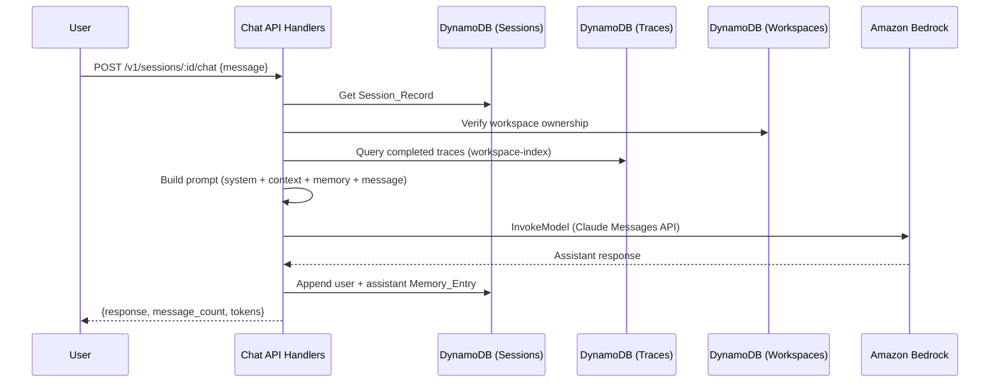

# Design Document: Memory/Chat System

## Overview

This design covers Phase 5 of the DocOps platform: a conversational memory/chat system that lets users query their processed documents through natural language. Users create chat sessions scoped to a workspace, send messages, and receive AI-generated responses grounded in extracted document data (trace fields).

Key architectural decisions:
- **Chat lives in the TypeScript API layer**: Session CRUD and the chat endpoint are API handlers, keeping the architecture consistent with Phases 1–4. The Bedrock call is made from a dedicated chat handler module.
- **Context grounding from traces**: The Context_Retriever fetches completed trace fields from the workspace and formats them as structured text injected into the LLM prompt.
- **Memory stored in DynamoDB**: The full conversation history is persisted in the session's `memory` array. A sliding window is used for the LLM prompt to stay within token limits.
- **No separate Lambda**: The chat endpoint runs in the existing API Lambda. Bedrock calls add latency but stay within the 30s API Gateway timeout for typical conversations.



## Architecture

### Module Structure

```
api/src/
├── handlers/
│   ├── sessions.ts          # NEW: Session CRUD (create, list, get, delete)
│   ├── chat.ts              # NEW: Chat message handler + context retriever + Bedrock client
│   ├── health.ts
│   ├── process.ts
│   ├── traces.ts
│   ├── hitl.ts
│   └── workspace.ts
├── lib/
│   ├── dynamo.ts            # Existing: already has getItem, putItem, queryIndex, deleteCommand
│   └── bedrock.ts           # NEW: Bedrock InvokeModel client wrapper
├── middleware/
│   ├── auth.ts
│   ├── plan-enforcer.ts
│   └── tenant.ts
├── models/
│   └── types.ts             # Existing: Session already defined, add MemoryEntry + ChatRequest types
├── handler.ts
└── router.ts                # Existing: replace session stub with real routes
```

### Infrastructure

No new CDK stacks needed. Existing infrastructure supports Phase 5:

- **DynamoDB `docops-sessions` table**: Already provisioned in `DatabaseStack` with `session_id` partition key and `workspace-index` GSI on `workspace_id`
- **DynamoDB `docops-traces` table**: Already has `workspace-index` GSI for querying traces by workspace
- **Bedrock permissions**: Already granted in `ProcessingStack` for Claude Haiku and Sonnet models
- **API Lambda**: The existing `docops-api` Lambda in `ApiStack` needs Bedrock invoke permissions added (currently only the processor Lambda has them)

One infrastructure change required:
- **ApiStack**: Add `bedrock:InvokeModel` IAM permission to the API Lambda function for the same model ARNs already used in ProcessingStack.

## Components and Interfaces

### 1. Session Handlers (`api/src/handlers/sessions.ts`)

CRUD operations for chat sessions.

#### `handleCreateSession(req: ApiRequest): Promise<ApiResponse>`

Handles `POST /v1/workspaces/:id/sessions`. Body: `{ title?: string }`.

Logic:
1. Extract `workspace_id` from path params
2. Verify workspace exists and belongs to requesting tenant
3. Generate `session_id` using `crypto.randomUUID()`
4. Create Session_Record: `{ session_id, workspace_id, tenant_id, title, memory: [], created_at }`
5. Put item to sessions table
6. Return 201 with created session

#### `handleListSessions(req: ApiRequest): Promise<ApiResponse>`

Handles `GET /v1/workspaces/:id/sessions`.

Logic:
1. Extract `workspace_id` from path params
2. Verify workspace ownership
3. Query `workspace-index` GSI on sessions table
4. Sort by `created_at` descending
5. Map each session to summary (exclude full memory, include `message_count: memory.length`)
6. Return `{ sessions: [...], count: N }`

#### `handleGetSession(req: ApiRequest): Promise<ApiResponse>`

Handles `GET /v1/sessions/:id`.

Logic:
1. Get Session_Record by `session_id`
2. If not found, return 404
3. Verify tenant ownership via workspace lookup
4. Return full session including memory array

#### `handleDeleteSession(req: ApiRequest): Promise<ApiResponse>`

Handles `DELETE /v1/sessions/:id`.

Logic:
1. Get Session_Record by `session_id`
2. If not found, return 404
3. Verify tenant ownership
4. Delete item from sessions table
5. Return 200 with confirmation

### 2. Chat Handler (`api/src/handlers/chat.ts`)

The core chat message processing pipeline.

#### `handleChatMessage(req: ApiRequest): Promise<ApiResponse>`

Handles `POST /v1/sessions/:id/chat`. Body: `{ message: string }`.

Logic:
1. Validate `message` is non-empty string, return 400 if missing
2. Get Session_Record by `session_id`, return 404 if missing
3. Verify tenant ownership via workspace lookup
4. Call `retrieveContext(workspace_id)` to get trace field context
5. Call `buildPrompt(context, session.memory, message)` to construct the LLM prompt
6. Call `invokeModel(prompt)` to get the assistant response
7. Create two Memory_Entry items: `{ role: "user", content: message, timestamp }` and `{ role: "assistant", content: response, timestamp }`
8. Append both entries to session memory using DynamoDB `list_append` update
9. Return `{ response: string, message_count: number, tokens: { input, output } }`

If Bedrock invocation fails, return 502 without appending any memory entries.

#### `retrieveContext(workspaceId: string): Promise<string>`

Fetches grounding context from workspace traces.

Logic:
1. Query `workspace-index` GSI on traces table for the workspace
2. Filter to traces with `status = "completed"` and non-empty `fields`
3. Sort by `created_at` descending (newest first)
4. Format each trace as structured text block:
   ```
   Document: {filename} (trace: {trace_id})
   Fields:
   - {field_name}: {value}
   - {field_name}: {value}
   ```
5. Concatenate trace blocks, estimating tokens (chars / 4 approximation)
6. If total exceeds context budget (default 4000 tokens), truncate oldest traces
7. If no completed traces, return empty string

#### `buildPrompt(context: string, memory: MemoryEntry[], userMessage: string): Messages`

Constructs the Claude Messages API prompt.

```typescript
function buildPrompt(
  context: string,
  memory: MemoryEntry[],
  userMessage: string
): { system: string; messages: Array<{ role: string; content: string }> } {
  const systemPrompt = context
    ? `You are a helpful document assistant for the DocOps platform. Answer questions based on the following extracted document data. If the answer is not found in the provided data, say so clearly.\n\nDocument Data:\n${context}`
    : `You are a helpful document assistant for the DocOps platform. No processed documents are available in this workspace yet. Let the user know they need to process documents first before you can answer questions about them.`;

  // Apply memory window — truncate oldest if over budget
  const memoryWindow = truncateMemory(memory);

  const messages = [
    ...memoryWindow.map(m => ({ role: m.role, content: m.content })),
    { role: 'user', content: userMessage },
  ];

  return { system: systemPrompt, messages };
}
```

#### `truncateMemory(memory: MemoryEntry[]): MemoryEntry[]`

Applies sliding window to keep memory within token budget.

```typescript
const MEMORY_TOKEN_BUDGET = 4000;
const MIN_RECENT_EXCHANGES = 2; // Keep at least 2 exchanges (4 messages)

function truncateMemory(memory: MemoryEntry[]): MemoryEntry[] {
  const minMessages = MIN_RECENT_EXCHANGES * 2;

  if (memory.length <= minMessages) return memory;

  let window = [...memory];
  while (estimateTokens(window) > MEMORY_TOKEN_BUDGET && window.length > minMessages) {
    // Remove oldest pair (user + assistant)
    window = window.slice(2);
  }
  return window;
}

function estimateTokens(entries: MemoryEntry[]): number {
  return entries.reduce((sum, e) => sum + Math.ceil(e.content.length / 4), 0);
}
```

### 3. Bedrock Client (`api/src/lib/bedrock.ts`)

Wrapper around the AWS Bedrock Runtime SDK.

```typescript
import { BedrockRuntimeClient, InvokeModelCommand } from '@aws-sdk/client-bedrock-runtime';

const client = new BedrockRuntimeClient({ region: process.env.AWS_REGION ?? 'us-east-1' });
const MODEL_ID = process.env.BEDROCK_MODEL_ID ?? 'anthropic.claude-3-haiku-20240307-v1:0';
const MAX_OUTPUT_TOKENS = 1024;

interface InvokeResult {
  response: string;
  inputTokens: number;
  outputTokens: number;
}

export async function invokeModel(
  system: string,
  messages: Array<{ role: string; content: string }>
): Promise<InvokeResult> {
  const body = JSON.stringify({
    anthropic_version: 'bedrock-2023-05-31',
    max_tokens: MAX_OUTPUT_TOKENS,
    system,
    messages,
  });

  try {
    const result = await client.send(new InvokeModelCommand({
      modelId: MODEL_ID,
      contentType: 'application/json',
      accept: 'application/json',
      body,
    }));

    const parsed = JSON.parse(new TextDecoder().decode(result.body));
    return {
      response: parsed.content[0]?.text ?? '',
      inputTokens: parsed.usage?.input_tokens ?? 0,
      outputTokens: parsed.usage?.output_tokens ?? 0,
    };
  } catch (err: unknown) {
    // Retry once on throttling
    if (isThrottlingError(err)) {
      await sleep(1000);
      const retry = await client.send(new InvokeModelCommand({
        modelId: MODEL_ID,
        contentType: 'application/json',
        accept: 'application/json',
        body,
      }));
      const parsed = JSON.parse(new TextDecoder().decode(retry.body));
      return {
        response: parsed.content[0]?.text ?? '',
        inputTokens: parsed.usage?.input_tokens ?? 0,
        outputTokens: parsed.usage?.output_tokens ?? 0,
      };
    }
    throw err;
  }
}

function isThrottlingError(err: unknown): boolean {
  return (err as any)?.name === 'ThrottlingException'
    || (err as any)?.$metadata?.httpStatusCode === 429;
}

function sleep(ms: number): Promise<void> {
  return new Promise(resolve => setTimeout(resolve, ms));
}
```

### 4. Router Updates (`api/src/router.ts`)

Replace the session stub and add new routes:

```typescript
// Chat Sessions
const createSessionMatch = matchPath('/v1/workspaces/:id/sessions', path);
if (method === 'POST' && createSessionMatch) {
  req.pathParams = createSessionMatch;
  return handleCreateSession(req);
}
if (method === 'GET' && createSessionMatch) {
  req.pathParams = createSessionMatch;
  return handleListSessions(req);
}

const sessionDetailMatch = matchPath('/v1/sessions/:id', path);
if (method === 'GET' && sessionDetailMatch) {
  req.pathParams = sessionDetailMatch;
  return handleGetSession(req);
}
if (method === 'DELETE' && sessionDetailMatch) {
  req.pathParams = sessionDetailMatch;
  return handleDeleteSession(req);
}

const chatMatch = matchPath('/v1/sessions/:id/chat', path);
if (method === 'POST' && chatMatch) {
  req.pathParams = chatMatch;
  return handleChatMessage(req);
}
```

Remove the existing `/v1/sessions/:id/chat` stub from the `stubPaths` array.

### 5. Infrastructure Update (`infra/lib/api-stack.ts`)

Add Bedrock invoke permission to the API Lambda:

```typescript
this.apiFunction.addToRolePolicy(
  new iam.PolicyStatement({
    effect: iam.Effect.ALLOW,
    actions: ['bedrock:InvokeModel'],
    resources: [
      `arn:aws:bedrock:${this.region}::foundation-model/anthropic.claude-3-haiku-20240307-v1:0`,
      `arn:aws:bedrock:${this.region}::foundation-model/anthropic.claude-3-sonnet-20240229-v1:0`,
    ],
  })
);
```

Add `BEDROCK_MODEL_ID` environment variable to the API Lambda.

## Data Models

### MemoryEntry Type (new in types.ts)

```typescript
export interface MemoryEntry {
  role: 'user' | 'assistant';
  content: string;
  timestamp: string;
}
```

### ChatRequest Type (new in types.ts)

```typescript
export interface ChatRequest {
  message: string;
}
```

### ChatResponse Type (new in types.ts)

```typescript
export interface ChatResponse {
  response: string;
  message_count: number;
  tokens: {
    input: number;
    output: number;
  };
}
```

### Enhanced Session (updated in types.ts)

```typescript
export interface Session {
  session_id: string;
  workspace_id: string;
  tenant_id: string;
  title: string;
  memory: MemoryEntry[];
  created_at: string;
}
```

### Enhanced Session Pydantic Model (updated in models.py)

```python
class MemoryEntry(BaseModel):
    role: str  # "user" or "assistant"
    content: str
    timestamp: datetime = Field(default_factory=datetime.utcnow)

class Session(BaseModel):
    session_id: str
    workspace_id: str
    tenant_id: str
    title: str = "New Chat"
    memory: list[MemoryEntry] = Field(default_factory=list)
    created_at: datetime = Field(default_factory=datetime.utcnow)
```

### Session_Record in DynamoDB

| Attribute | Type | Description |
|-----------|------|-------------|
| `session_id` | String (PK) | Unique session identifier |
| `workspace_id` | String (GSI: workspace-index) | Workspace this session belongs to |
| `tenant_id` | String | Tenant that owns the session |
| `title` | String | Session title (user-provided or default) |
| `memory` | List[Map] | `[{role, content, timestamp}]` |
| `created_at` | String (ISO) | When session was created |

### API Response Shapes

**POST /v1/workspaces/:id/sessions** (201)
```json
{
  "session_id": "sess-abc-123",
  "workspace_id": "ws-456",
  "tenant_id": "t-789",
  "title": "Invoice Questions",
  "memory": [],
  "created_at": "2024-01-20T10:00:00Z"
}
```

**GET /v1/workspaces/:id/sessions** (200)
```json
{
  "sessions": [
    {
      "session_id": "sess-abc-123",
      "workspace_id": "ws-456",
      "title": "Invoice Questions",
      "message_count": 6,
      "created_at": "2024-01-20T10:00:00Z"
    }
  ],
  "count": 1
}
```

**POST /v1/sessions/:id/chat** (200)
```json
{
  "response": "Based on the processed invoices, the total amount for INV-001 is $1,250.00. The invoice was issued on January 15, 2024.",
  "message_count": 4,
  "tokens": {
    "input": 1850,
    "output": 42
  }
}
```

**POST /v1/sessions/:id/chat** (502 — Bedrock failure)
```json
{
  "error": "Failed to generate response from LLM service"
}
```

## Correctness Properties

*A property is a characteristic or behavior that should hold true across all valid executions of a system — essentially, a formal statement about what the system should do.*

### Property 1: Memory truncation preserves minimum recent exchanges

*For any* memory array and token budget, after truncation the resulting window contains at least `MIN_RECENT_EXCHANGES * 2` entries (4 messages), provided the original memory has at least that many entries.

**Validates: Requirements 6.1, 6.2**

### Property 2: Memory truncation removes oldest entries first

*For any* memory array that exceeds the token budget, the truncated window is a contiguous suffix of the original array (i.e., only leading entries are removed, ordering is preserved).

**Validates: Requirements 6.1**

### Property 3: Truncated memory token count is within budget or at minimum size

*For any* memory array, after truncation either the estimated token count is within the memory token budget, or the window is at the minimum size (4 messages).

**Validates: Requirements 6.1, 6.2**

### Property 4: Context retrieval only includes completed traces

*For any* workspace with a mix of trace statuses, the context string produced by the Context_Retriever contains field data only from traces with status `completed`.

**Validates: Requirements 5.1**

### Property 5: Context truncation respects token budget

*For any* set of completed traces, the formatted context string's estimated token count does not exceed the context token budget. Traces are removed oldest-first when truncation is needed.

**Validates: Requirements 5.5**

### Property 6: Chat exchange appends exactly two memory entries

*For any* successful chat message exchange, the session memory grows by exactly two entries: one with role `user` and one with role `assistant`, in that order, appended at the end.

**Validates: Requirements 4.5**

### Property 7: Failed Bedrock call leaves memory unchanged

*For any* chat message where the Bedrock invocation fails, the session memory array remains identical to its state before the request.

**Validates: Requirements 4.10**

### Property 8: Session list excludes full memory contents

*For any* list sessions response, each session object in the array contains `message_count` (a number) but does not contain the `memory` array.

**Validates: Requirements 2.5**

### Property 9: Token estimation is proportional to content length

*For any* list of MemoryEntry items, the estimated token count equals the sum of `ceil(content.length / 4)` for each entry. This is a metamorphic property: doubling the content length approximately doubles the token estimate.

**Validates: Requirements 6.4**

### Property 10: Prompt construction includes all components in correct order

*For any* non-empty context, non-empty memory window, and user message, the constructed prompt contains: a system string with the context embedded, followed by messages array with memory entries first and the user message last.

**Validates: Requirements 4.3**

### Property 11: Tenant isolation — sessions are only accessible to owning tenant

*For any* chat API request, if the session's workspace belongs to tenant T, then only requests authenticated as tenant T should receive a successful response. All other tenants should receive 403.

**Validates: Requirements 8.1, 8.2**

### Property 12: Context retrieval does not leak cross-workspace data

*For any* chat session scoped to workspace W, the Context_Retriever only queries traces belonging to workspace W. No trace data from other workspaces appears in the context.

**Validates: Requirements 8.4**

## Error Handling

### Error Categories

| Error Type | Source | HTTP Status | Error Message Pattern |
|-----------|--------|-------------|----------------------|
| Session not found | GET/POST/DELETE with unknown session_id | 404 | `"Session not found"` |
| Workspace not found | Create session for unknown workspace | 404 | `"Workspace not found"` |
| Forbidden | Tenant doesn't own workspace | 403 | `"Forbidden"` |
| Missing message | Chat without message field | 400 | `"message field is required"` |
| Empty message | Chat with empty string message | 400 | `"message field is required"` |
| Bedrock failure | InvokeModel API error | 502 | `"Failed to generate response from LLM service"` |
| Bedrock throttling (after retry) | InvokeModel throttled twice | 502 | `"Failed to generate response from LLM service"` |
| DynamoDB write failure | Session update fails | 500 | `"Failed to update session"` |

### Error Handling Strategy

- All handlers follow: validate input → check existence → check ownership → perform operation
- Bedrock errors are caught and mapped to 502 to avoid leaking AWS internals
- Throttling gets one retry with 1s delay; if retry also fails, return 502
- Memory append failure after successful Bedrock call is logged but returns the response to the user (best-effort persistence)
- All errors return structured JSON: `{ "error": "message" }`

## Testing Strategy

### Property-Based Testing

Property-based tests use `fast-check` (TypeScript PBT library) to verify universal properties.

Properties to implement as PBT:
- **Property 1**: Generate random memory arrays of varying lengths and content sizes, verify truncation preserves minimum 4 entries
- **Property 2**: Generate random memory arrays, verify truncated result is a suffix of the original
- **Property 3**: Generate random memory arrays, verify post-truncation token count is within budget or at minimum size
- **Property 5**: Generate random sets of trace field data with varying sizes, verify context fits within budget
- **Property 6**: Generate random existing memory arrays and new messages, verify exactly 2 entries appended
- **Property 9**: Generate random content strings, verify token estimation formula

### Unit Testing

Unit tests cover specific examples, edge cases, and integration points:

- **Edge cases**:
  - Chat with empty workspace (no traces) → response tells user to process documents first
  - Chat with session that has zero memory → first exchange works correctly
  - Memory at exactly the minimum size (4 entries) → no truncation occurs
  - Memory with one very long message exceeding budget → truncated to minimum window
  - Context with single trace having many fields → fits or truncates fields
  - Delete non-existent session → 404
  - Create session for non-existent workspace → 404
  - Bedrock returns empty content array → empty response string returned
  - Bedrock throttled once then succeeds → response returned normally
  - Bedrock throttled twice → 502 returned

- **Integration tests** (mocked AWS services):
  - Full lifecycle: create session → send message → get session → verify memory → delete
  - List sessions returns summaries without memory
  - Context retrieval with mix of completed/pending/failed traces
  - Multi-turn conversation: send 3 messages, verify memory grows correctly
  - Tenant isolation: request from wrong tenant returns 403

### Test Organization

```
api/src/__tests__/
├── sessions.test.ts           # Session CRUD handler tests
├── chat.test.ts               # Chat message handler tests (property + unit)
├── chat-context.test.ts       # Context retrieval tests
├── chat-memory.test.ts        # Memory truncation tests (property + unit)
└── bedrock.test.ts            # Bedrock client tests (retry, error handling)
```

### Dependencies

- `fast-check` — property-based testing for TypeScript
- `vitest` — test runner (existing)
- `aws-sdk-client-mock` — DynamoDB and Bedrock mocking
- `@aws-sdk/client-bedrock-runtime` — Bedrock SDK (new production dependency)
