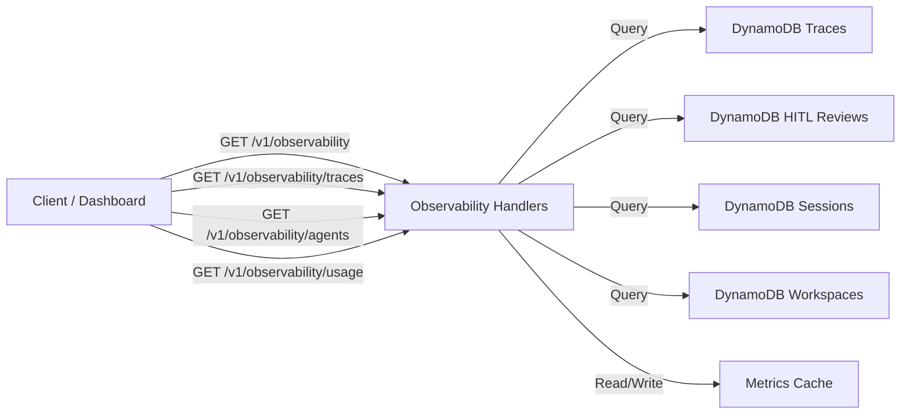

# Design Document: Observability and Tracing

## Overview

This design covers Phase 6 of the DocOps platform: observability and tracing. The system computes aggregate metrics from existing DynamoDB records (traces, HITL reviews, sessions) and exposes them through four REST API endpoints. All metrics are computed on-the-fly with an in-memory TTL cache to reduce DynamoDB read costs on repeated dashboard loads.



Key design decisions:
- **Compute on read, not write**: Metrics are aggregated at query time from raw DynamoDB records rather than maintaining pre-computed counters. This avoids write amplification and keeps the data model simple. The cache layer mitigates the read cost.
- **Single handler module**: All four observability endpoints share common filtering, aggregation, and caching logic, so they live in one handler file with shared utility functions.
- **Lambda-scoped cache**: The cache lives in module-level variables within the Lambda execution context. It survives across warm invocations but resets on cold starts. This is acceptable because the data is not time-critical (dashboard metrics tolerate 60s staleness).
- **No new DynamoDB tables or GSIs**: All queries use existing tables and indexes (workspace-index on traces, status-index on HITL reviews, workspace-index on sessions).

## Architecture

### Module Structure

```
api/src/
├── handlers/
│   ├── observability.ts     # NEW: All observability endpoint handlers
│   ├── health.ts
│   ├── process.ts
│   ├── traces.ts
│   ├── hitl.ts
│   └── workspace.ts
├── lib/
│   ├── dynamo.ts            # Existing: add scanTable helper
│   ├── metrics-cache.ts     # NEW: In-memory TTL cache
│   └── metrics-engine.ts    # NEW: Aggregation computation logic
├── middleware/
│   ├── auth.ts
│   ├── plan-enforcer.ts
│   └── tenant.ts
├── models/
│   └── types.ts             # Existing: add observability response types
├── handler.ts
└── router.ts                # Existing: replace stub with real observability routes
```

### Infrastructure

No new infrastructure needed. All data sources already exist:
- `docops-traces` table with `workspace-index` GSI
- `docops-hitl-reviews` table with `status-index` GSI
- `docops-sessions` table with `workspace-index` GSI
- `docops-workspaces` table with `tenant-index` GSI

The API Lambda already has read/write permissions on all five tables.

## Components and Interfaces

### 1. Metrics Cache (`api/src/lib/metrics-cache.ts`)

A simple in-memory TTL cache scoped to the Lambda execution context.

```typescript
interface CacheEntry<T> {
  data: T;
  expiresAt: number; // Date.now() + ttlMs
}

class MetricsCache {
  private cache = new Map<string, CacheEntry<unknown>>();
  private readonly maxEntries: number;
  private readonly defaultTtlMs: number;

  constructor(maxEntries = 100, defaultTtlMs = 60_000) { ... }

  get<T>(key: string): T | null {
    // Return cached data if TTL not expired, otherwise delete and return null
  }

  set<T>(key: string, data: T, ttlMs?: number): void {
    // Evict oldest entry if at capacity, then store with expiry
  }

  buildKey(tenantId: string, path: string, params: Record<string, string>): string {
    // Deterministic key: sort params, join as "tenantId:path:k1=v1&k2=v2"
  }

  clear(): void { ... }
  get size(): number { ... }
}

// Module-level singleton — survives across warm Lambda invocations
export const metricsCache = new MetricsCache();
```

Cache key format: `{tenant_id}:{path}:{sorted_query_params}`

Example: `tenant-abc:/v1/observability:range=7d&workspace_id=ws-123`

Eviction: When the cache reaches 100 entries, the oldest entry (by insertion order, using Map iteration order) is deleted before inserting the new one.

### 2. Metrics Engine (`api/src/lib/metrics-engine.ts`)

Pure computation functions that take arrays of records and return aggregated metrics. No DynamoDB access — this module is purely functional for testability.

```typescript
// Time range resolution
export function resolveTimeRange(params: {
  range?: string;
  start?: string;
  end?: string;
}): { startDate: Date; endDate: Date } {
  // If start/end provided, use them (start/end takes precedence over range)
  // If range provided: 24h, 7d, 30d relative to now
  // Default: last 30 days
}

// Filter records by time range
export function filterByTimeRange<T extends { created_at: string }>(
  records: T[],
  startDate: Date,
  endDate: Date
): T[] { ... }

// Dashboard aggregate metrics
export interface DashboardMetrics {
  total_traces: number;
  success_count: number;
  failure_count: number;
  hitl_required_count: number;
  success_rate: number;
  failure_rate: number;
  average_confidence: number;
  average_latency_ms: number;
  total_tokens: number;
}

export function computeDashboardMetrics(traces: TraceRecord[]): DashboardMetrics {
  // Count by status, compute rates (0 when total is 0)
  // Average confidence/latency only from non-null values
}

// HITL metrics
export interface HitlMetrics {
  total_reviews: number;
  pending_count: number;
  in_review_count: number;
  resolved_count: number;
  average_review_duration_ms: number;
  average_correction_count: number;
}

export function computeHitlMetrics(reviews: ReviewRecord[]): HitlMetrics { ... }

// Agent step metrics
export interface AgentMetrics {
  agent_name: string;
  total_executions: number;
  success_count: number;
  error_count: number;
  average_latency_ms: number;
  total_input_tokens: number;
  total_output_tokens: number;
  models: Array<{ model_id: string; execution_count: number; average_latency_ms: number }>;
}

export function computeAgentMetrics(traces: TraceRecord[]): AgentMetrics[] {
  // Flatten agent_steps from all traces, group by agent_name
  // Within each agent, sub-group by model_id
}

// Error analysis
export interface ErrorGroup {
  error_message: string;
  count: number;
}

export function computeErrorAnalysis(traces: TraceRecord[], limit = 10): ErrorGroup[] {
  // Filter to failed traces, group by error field, sort by count desc, take top N
}

// Time-series bucketing
export interface TimeSeriesBucket {
  bucket_start: string; // ISO 8601 date
  metrics: DashboardMetrics;
}

export function computeTimeSeries(
  traces: TraceRecord[],
  granularity: 'daily' | 'weekly',
  startDate: Date,
  endDate: Date
): TimeSeriesBucket[] {
  // Bucket traces by day or ISO week
  // Fill empty buckets with zero-value DashboardMetrics
}

// Per-workspace grouping
export interface WorkspaceMetrics {
  workspace_id: string;
  workspace_name: string;
  metrics: DashboardMetrics;
}

export function groupByWorkspace(
  traces: TraceRecord[],
  workspaceNames: Map<string, string>
): WorkspaceMetrics[] { ... }

// Usage summary
export interface UsageSummary {
  total_documents_processed: number;
  total_tokens_consumed: number;
  workspace_count: number;
  active_sessions_count: number;
  plan: string;
  plan_limits: { docs_per_month: number; workspaces: number };
}

export function computeUsageSummary(
  traces: TraceRecord[],
  workspaceCount: number,
  activeSessions: number,
  plan: string,
  planLimits: { docs_per_month: number; workspaces: number }
): UsageSummary { ... }
```

### 3. Observability Handlers (`api/src/handlers/observability.ts`)

Four handler functions that orchestrate data fetching, caching, and metric computation.

#### `handleGetDashboard(req: ApiRequest): Promise<ApiResponse>`

Handles `GET /v1/observability`.

Logic:
1. Check cache for matching key → return cached if valid
2. Resolve time range from query params
3. If `workspace_id` provided, verify tenant ownership
4. Fetch tenant's workspaces via `tenant-index` on workspaces table
5. Fetch traces via `workspace-index` for each workspace (or single workspace)
6. Filter traces by time range
7. Compute `DashboardMetrics` from filtered traces
8. Fetch HITL reviews for matching workspaces, filter by time range, compute `HitlMetrics`
9. Compute `ErrorAnalysis` from failed traces
10. If `group_by=workspace`, group metrics by workspace
11. If `granularity=daily|weekly`, compute time-series buckets
12. Cache result, return response

#### `handleGetTraceMetrics(req: ApiRequest): Promise<ApiResponse>`

Handles `GET /v1/observability/traces`.

Logic:
1. Check cache → return cached if valid
2. Resolve time range, verify workspace ownership if specified
3. Fetch traces for tenant's workspaces
4. Filter by time range, status (if provided)
5. Sort by `created_at` descending
6. Return trace list with count

#### `handleGetAgentMetrics(req: ApiRequest): Promise<ApiResponse>`

Handles `GET /v1/observability/agents`.

Logic:
1. Check cache → return cached if valid
2. Resolve time range, verify workspace ownership if specified
3. Fetch traces for tenant's workspaces
4. Filter by time range
5. Compute `AgentMetrics` from agent_steps arrays
6. Cache and return

#### `handleGetUsage(req: ApiRequest): Promise<ApiResponse>`

Handles `GET /v1/observability/usage`.

Logic:
1. Check cache → return cached if valid
2. Resolve time range
3. Fetch all tenant workspaces (count)
4. Fetch all traces across tenant workspaces, filter by time range
5. Fetch sessions across tenant workspaces, count active ones
6. Get tenant record for plan info
7. Compute `UsageSummary`
8. Cache and return

### 4. DynamoDB Helpers

New helper needed in `dynamo.ts` for fetching all records from a table (used when querying across multiple workspaces):

```typescript
export async function queryAllForWorkspaces<T>(
  tableName: string,
  indexName: string,
  workspaceIds: string[]
): Promise<T[]> {
  // Execute parallel queries on workspace-index for each workspace_id
  // Concatenate results
  const results = await Promise.all(
    workspaceIds.map(wsId =>
      queryIndex<T>(tableName, indexName, 'workspace_id', wsId)
    )
  );
  return results.flat();
}
```

### 5. Router Updates (`api/src/router.ts`)

Replace the observability stub with real routes:

```typescript
// Observability endpoints
if (method === 'GET' && path === '/v1/observability') {
  return handleGetDashboard(req);
}
if (method === 'GET' && path === '/v1/observability/traces') {
  return handleGetTraceMetrics(req);
}
if (method === 'GET' && path === '/v1/observability/agents') {
  return handleGetAgentMetrics(req);
}
if (method === 'GET' && path === '/v1/observability/usage') {
  return handleGetUsage(req);
}
```

## Data Models

### Trace Record (read shape for metrics)

The observability service reads these fields from existing Trace_Records:

| Field | Type | Used For |
|-------|------|----------|
| `trace_id` | String | Unique identifier |
| `workspace_id` | String | Workspace grouping |
| `status` | String | Success/failure/hitl counting |
| `confidence` | Number (nullable) | Average confidence |
| `tokens` | Number (nullable) | Token consumption |
| `latency` | Number (nullable) | Latency averaging |
| `agent_steps` | List[Map] (nullable) | Agent performance metrics |
| `error` | String (nullable) | Error analysis |
| `created_at` | String (ISO 8601) | Time-range filtering |

### Review Record (read shape for metrics)

| Field | Type | Used For |
|-------|------|----------|
| `trace_id` | String | Linking to trace |
| `workspace_id` | String | Workspace filtering |
| `status` | String | Review status counting |
| `review_duration_ms` | Number (nullable) | Average review duration |
| `correction_count` | Number (nullable) | Average corrections |
| `created_at` | String (ISO 8601) | Time-range filtering |

### API Response Shapes

**GET /v1/observability**
```json
{
  "dashboard": {
    "total_traces": 150,
    "success_count": 120,
    "failure_count": 10,
    "hitl_required_count": 20,
    "success_rate": 0.8,
    "failure_rate": 0.067,
    "average_confidence": 0.87,
    "average_latency_ms": 3200,
    "total_tokens": 450000
  },
  "hitl": {
    "total_reviews": 20,
    "pending_count": 5,
    "in_review_count": 3,
    "resolved_count": 12,
    "average_review_duration_ms": 180000,
    "average_correction_count": 2.3
  },
  "error_analysis": [
    { "error_message": "Docling service timed out after 60s", "count": 5 },
    { "error_message": "Bedrock API error: ThrottlingException", "count": 3 }
  ],
  "time_range": { "start": "2024-01-01T00:00:00Z", "end": "2024-01-31T23:59:59Z" }
}
```

**GET /v1/observability?group_by=workspace**
```json
{
  "workspaces": [
    {
      "workspace_id": "ws-123",
      "workspace_name": "Invoice Processing",
      "metrics": { "total_traces": 80, "success_rate": 0.85, "..." : "..." }
    }
  ],
  "time_range": { "start": "...", "end": "..." }
}
```

**GET /v1/observability?granularity=daily&range=7d**
```json
{
  "time_series": [
    { "bucket_start": "2024-01-25", "metrics": { "total_traces": 20, "..." : "..." } },
    { "bucket_start": "2024-01-26", "metrics": { "total_traces": 0, "..." : "..." } },
    { "bucket_start": "2024-01-27", "metrics": { "total_traces": 15, "..." : "..." } }
  ],
  "time_range": { "start": "...", "end": "..." }
}
```

**GET /v1/observability/traces?status=failed&range=7d**
```json
{
  "traces": [
    {
      "trace_id": "t-abc",
      "workspace_id": "ws-123",
      "status": "failed",
      "confidence": null,
      "tokens": 0,
      "latency": null,
      "error": "Docling service timed out after 60s",
      "created_at": "2024-01-27T14:30:00Z"
    }
  ],
  "count": 1,
  "time_range": { "start": "...", "end": "..." }
}
```

**GET /v1/observability/agents**
```json
{
  "agents": [
    {
      "agent_name": "extraction",
      "total_executions": 300,
      "success_count": 290,
      "error_count": 10,
      "average_latency_ms": 2100,
      "total_input_tokens": 375000,
      "total_output_tokens": 75000,
      "models": [
        { "model_id": "anthropic.claude-3-haiku-20240307-v1:0", "execution_count": 200, "average_latency_ms": 1800 },
        { "model_id": "anthropic.claude-3-sonnet-20240229-v1:0", "execution_count": 100, "average_latency_ms": 2700 }
      ]
    }
  ],
  "total_traces": 150,
  "time_range": { "start": "...", "end": "..." }
}
```

**GET /v1/observability/usage**
```json
{
  "usage": {
    "total_documents_processed": 150,
    "total_tokens_consumed": 450000,
    "workspace_count": 3,
    "active_sessions_count": 5,
    "plan": "pro",
    "plan_limits": { "docs_per_month": 500, "workspaces": 20 }
  },
  "time_range": { "start": "...", "end": "..." }
}
```

### TypeScript Types (additions to types.ts)

```typescript
export interface DashboardMetrics {
  total_traces: number;
  success_count: number;
  failure_count: number;
  hitl_required_count: number;
  success_rate: number;
  failure_rate: number;
  average_confidence: number;
  average_latency_ms: number;
  total_tokens: number;
}

export interface HitlMetrics {
  total_reviews: number;
  pending_count: number;
  in_review_count: number;
  resolved_count: number;
  average_review_duration_ms: number;
  average_correction_count: number;
}

export interface AgentMetrics {
  agent_name: string;
  total_executions: number;
  success_count: number;
  error_count: number;
  average_latency_ms: number;
  total_input_tokens: number;
  total_output_tokens: number;
  models: Array<{ model_id: string; execution_count: number; average_latency_ms: number }>;
}

export interface ErrorGroup {
  error_message: string;
  count: number;
}

export interface TimeSeriesBucket {
  bucket_start: string;
  metrics: DashboardMetrics;
}

export interface WorkspaceMetricsGroup {
  workspace_id: string;
  workspace_name: string;
  metrics: DashboardMetrics;
}

export interface UsageSummary {
  total_documents_processed: number;
  total_tokens_consumed: number;
  workspace_count: number;
  active_sessions_count: number;
  plan: string;
  plan_limits: { docs_per_month: number; workspaces: number };
}
```

## Correctness Properties

*A property is a characteristic or behavior that should hold true across all valid executions of a system — essentially, a formal statement about what the system should do.*

### Property 1: Success rate plus failure rate plus hitl_required rate equals 1.0

*For any* non-empty list of Trace_Records, the sum of `success_rate + failure_rate + hitl_required_count / total_traces` should equal 1.0 (within floating-point tolerance). When total_traces is 0, all rates should be 0.

**Validates: Requirements 1.1, 1.6**

### Property 2: Average confidence is the arithmetic mean of non-null confidence values

*For any* list of Trace_Records where at least one has a non-null `confidence` field, the computed `average_confidence` should equal the arithmetic mean of all non-null confidence values (within floating-point tolerance). When no records have confidence, the average should be 0.

**Validates: Requirements 1.7**

### Property 3: Average latency is the arithmetic mean of non-null latency values

*For any* list of Trace_Records where at least one has a non-null `latency` field, the computed `average_latency_ms` should equal the arithmetic mean of all non-null latency values (within floating-point tolerance). When no records have latency, the average should be 0.

**Validates: Requirements 1.8**

### Property 4: Time-range filtering includes only records within bounds

*For any* list of records with `created_at` timestamps and a time range [start, end], the filtered result should contain exactly those records where `start <= created_at <= end`. No record outside the range should be included, and no record inside the range should be excluded.

**Validates: Requirements 2.1, 2.2**

### Property 5: Custom start/end takes precedence over range preset

*For any* query parameters containing both `range` and `start`/`end`, the resolved time range should match the `start`/`end` values, not the preset range.

**Validates: Requirements 2.3**

### Property 6: Total tokens equals sum of individual trace tokens

*For any* list of Trace_Records, the `total_tokens` in Dashboard_Metrics should equal the sum of the `tokens` field across all records (treating null as 0).

**Validates: Requirements 1.1, 8.3**

### Property 7: Per-workspace metrics sum to tenant-wide metrics

*For any* set of Trace_Records grouped by workspace, the sum of `total_traces` across all workspace groups should equal the tenant-wide `total_traces`. The sum of `total_tokens` across groups should equal the tenant-wide `total_tokens`.

**Validates: Requirements 4.1, 4.3**

### Property 8: Agent step metrics are consistent with trace-level totals

*For any* set of Trace_Records with agent_steps, the sum of `total_executions` across all agent groups should equal the total number of agent_step entries across all traces. The sum of `total_input_tokens + total_output_tokens` across all agent groups should equal the sum of all agent step token fields.

**Validates: Requirements 5.1, 5.2**

### Property 9: Error analysis groups are sorted by count descending and capped at limit

*For any* list of failed Trace_Records, the `error_analysis` result should be sorted by `count` descending, contain at most `limit` entries, and the sum of all counts should be less than or equal to the total number of failed traces.

**Validates: Requirements 7.1, 7.2, 7.3**

### Property 10: Cache returns identical results within TTL

*For any* cache key and data stored with a TTL, calling `get` before the TTL expires should return data identical to what was stored. Calling `get` after the TTL expires should return null.

**Validates: Requirements 10.1, 10.3, 10.4**

### Property 11: Cache evicts oldest entry when at capacity

*For any* sequence of `set` operations that exceeds the max entries limit, the cache size should never exceed the limit. The evicted entry should be the one that was inserted earliest.

**Validates: Requirements 10.5, 10.6**

### Property 12: Time-series buckets cover the full time range with no gaps

*For any* time range and granularity (daily or weekly), the returned time-series buckets should form a contiguous sequence from the start date to the end date with no missing buckets. Empty buckets should have zero-value metrics.

**Validates: Requirements 9.1, 9.2, 9.4**

### Property 13: HITL average metrics computed only from resolved reviews

*For any* list of Review_Records, the `average_review_duration_ms` should be computed only from records with status `resolved` and non-null `review_duration_ms`. Records with other statuses should not affect the average.

**Validates: Requirements 6.2, 6.3**

## Error Handling

### Error Categories

| Error Type | Source | HTTP Status | Error Message Pattern |
|-----------|--------|-------------|----------------------|
| Invalid time range | start > end | 400 | `"Invalid time range: start must be before end"` |
| Invalid timestamp | Malformed ISO 8601 | 400 | `"Invalid {param}: must be a valid ISO 8601 timestamp"` |
| Invalid range preset | Unknown range value | 400 | `"Invalid range: must be one of 24h, 7d, 30d"` |
| Invalid granularity | Unknown granularity | 400 | `"Invalid granularity: must be daily or weekly"` |
| Workspace not found | Unknown workspace_id | 404 | `"Workspace not found"` |
| Forbidden | Workspace belongs to other tenant | 403 | `"Forbidden"` |
| DynamoDB read failure | Query/scan error | 500 | `"Failed to fetch metrics: {error}"` |

### Error Handling Strategy

- All handlers validate query parameters before any DynamoDB access
- Time range validation happens in `resolveTimeRange` and throws descriptive errors
- Workspace ownership is checked once per request before metric computation
- DynamoDB errors are caught and returned as 500 with a generic message (no internal details leaked)
- All errors return structured JSON: `{ "error": "message" }`

## Testing Strategy

### Property-Based Testing

Property-based tests use `fast-check` (TypeScript PBT library) to verify universal properties across randomly generated inputs.

Properties to implement as PBT:
- **Property 1**: Generate random lists of traces with various statuses, verify rate sum equals 1.0
- **Property 2**: Generate random lists of traces with nullable confidence, verify mean computation
- **Property 3**: Generate random lists of traces with nullable latency, verify mean computation
- **Property 4**: Generate random records with timestamps and time ranges, verify filtering correctness
- **Property 5**: Generate random query params with both range and start/end, verify precedence
- **Property 6**: Generate random traces with nullable tokens, verify sum
- **Property 7**: Generate random traces with workspace_ids, verify grouped sums equal total
- **Property 8**: Generate random traces with agent_steps arrays, verify execution count consistency
- **Property 9**: Generate random failed traces with error messages, verify sort and cap
- **Property 10**: Generate random cache entries with TTLs, verify get behavior before/after expiry
- **Property 11**: Generate sequences of cache sets exceeding capacity, verify size invariant
- **Property 12**: Generate random date ranges and granularities, verify contiguous bucket coverage
- **Property 13**: Generate random review records with mixed statuses, verify average computation

### Unit Testing

Unit tests cover specific examples, edge cases, and integration points:

- **Edge cases**:
  - Zero traces → all metrics are 0, rates are 0 (not NaN)
  - All traces have null confidence → average_confidence is 0
  - All traces have null latency → average_latency_ms is 0
  - No failed traces → error_analysis is empty array
  - No agent_steps on any trace → agents endpoint returns empty array
  - No HITL reviews → hitl metrics all zeros
  - No resolved reviews → average_review_duration_ms is 0
  - Time range with no data → empty time-series with zero-value buckets
  - Cache at capacity → oldest entry evicted
  - Cache TTL exactly expired → returns null (not stale data)
  - Single-day range with daily granularity → one bucket
  - Weekly granularity crossing month boundary → correct bucket assignment

- **Integration tests** (mocked DynamoDB):
  - Full dashboard request with workspace filter
  - Dashboard with group_by=workspace
  - Dashboard with granularity=daily
  - Trace metrics with status filter
  - Agent metrics with workspace filter
  - Usage summary with plan limits
  - Tenant isolation: request for other tenant's workspace returns 403
  - Cache hit on repeated identical request
  - Cache miss after TTL expiry

### Test Organization

```
api/src/__tests__/
├── observability.test.ts          # Handler integration tests
├── metrics-engine.test.ts         # Pure computation tests (property + unit)
├── metrics-cache.test.ts          # Cache behavior tests (property + unit)
└── time-range.test.ts             # Time range resolution tests (property + unit)
```

### Dependencies

- `fast-check` — property-based testing for TypeScript
- `vitest` — test runner (existing)
- `aws-sdk-client-mock` — DynamoDB mocking
