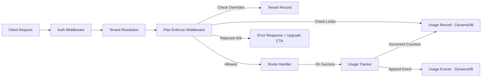

# Design Document: Pricing and Billing Enforcement

## Overview

This design covers Phase 8 of the DocOps platform: comprehensive pricing and billing enforcement. The system expands the existing plan-enforcer middleware from workspace-only checks to full enforcement across documents, tokens, chat messages, and workspaces. It introduces a new DynamoDB table for monthly usage tracking, plan management APIs, overage handling with soft/hard limits, and billing event recording for future Stripe integration.



Key design decisions:
- **DynamoDB atomic counters**: Usage counters use `ADD` operations for safe concurrent increments without read-modify-write races.
- **Composite key for usage records**: `tenant_id` (PK) + `billing_period` (SK, formatted YYYY-MM) enables efficient lookups and natural monthly partitioning.
- **Middleware-level enforcement**: All limit checks happen in the middleware pipeline before handlers execute, keeping enforcement centralized and consistent.
- **Soft limits via response headers**: Warning thresholds (80%) add headers without changing response bodies, so clients can progressively surface upgrade prompts.
- **Grace period stored on tenant**: Downgrade grace period is tracked via `downgrade_at` and `previous_plan` fields on the Tenant record, checked by the enforcer at request time.

## Architecture

### Module Structure

```
api/src/
├── handlers/
│   ├── billing.ts              # NEW: Plan management + usage export handlers
│   ├── health.ts
│   ├── process.ts              # MODIFIED: Call usage tracker after processing
│   ├── traces.ts
│   ├── workspace.ts
│   └── observability.ts
├── lib/
│   ├── dynamo.ts               # MODIFIED: Add atomic increment helper
│   ├── usage-tracker.ts        # NEW: Usage recording and retrieval
│   ├── plan-limits.ts          # NEW: Centralized plan limit configuration
│   └── metrics-cache.ts
├── middleware/
│   ├── auth.ts
│   ├── plan-enforcer.ts        # MODIFIED: Full resource enforcement
│   └── tenant.ts
├── models/
│   └── types.ts                # MODIFIED: Add billing/usage types
├── handler.ts                  # MODIFIED: Integrate enforcer into pipeline
└── router.ts                   # MODIFIED: Add billing routes
```

### Infrastructure Changes

Two new DynamoDB tables:

**`docops-usage` table** — Monthly usage counters per tenant
- Partition key: `tenant_id` (String)
- Sort key: `billing_period` (String, YYYY-MM format)
- No GSIs needed (all access is by tenant_id + billing_period)

**`docops-usage-events` table** — Immutable billing event log
- Partition key: `tenant_id` (String)
- Sort key: `event_id` (String, ULID for time-ordered uniqueness)
- GSI: `billing-period-index` on `billing_period` (PK) for export queries

## Components and Interfaces

### 1. Plan Limits Configuration (`api/src/lib/plan-limits.ts`)

Centralized, extensible plan limit definitions. Replaces the inline `PLAN_LIMITS` constant in types.ts.

```typescript
export interface PlanLimits {
  workspaces: number;
  docs_per_month: number;
  tokens_per_month: number;
  chats_per_month: number;
}

export const DEFAULT_PLAN_LIMITS: Record<Plan, PlanLimits> = {
  free: {
    workspaces: 2,
    docs_per_month: 10,
    tokens_per_month: 100_000,
    chats_per_month: 50,
  },
  pro: {
    workspaces: 20,
    docs_per_month: 500,
    tokens_per_month: 5_000_000,
    chats_per_month: 2_000,
  },
  enterprise: {
    workspaces: Infinity,
    docs_per_month: Infinity,
    tokens_per_month: Infinity,
    chats_per_month: Infinity,
  },
};

const SOFT_LIMIT_RATIO = 0.8;

export function getEffectiveLimits(
  tenant: Tenant
): PlanLimits {
  // If tenant has admin_override limits, use those
  if (tenant.admin_override_limits) {
    return tenant.admin_override_limits;
  }
  // If tenant is in grace period after downgrade, use previous plan limits
  if (tenant.downgrade_at && tenant.previous_plan) {
    const graceExpiry = new Date(tenant.downgrade_at);
    graceExpiry.setDate(graceExpiry.getDate() + 7);
    if (new Date() < graceExpiry) {
      return DEFAULT_PLAN_LIMITS[tenant.previous_plan];
    }
  }
  return DEFAULT_PLAN_LIMITS[tenant.plan];
}

export function getSoftLimit(hardLimit: number): number {
  if (hardLimit === Infinity) return Infinity;
  return Math.floor(hardLimit * SOFT_LIMIT_RATIO);
}
```

### 2. Usage Tracker (`api/src/lib/usage-tracker.ts`)

Handles all usage recording and retrieval using DynamoDB atomic operations.

```typescript
export function getCurrentBillingPeriod(): string {
  const now = new Date();
  return `${now.getUTCFullYear()}-${String(now.getUTCMonth() + 1).padStart(2, '0')}`;
}

export interface UsageRecord {
  tenant_id: string;
  billing_period: string;
  documents: number;
  tokens: number;
  chats: number;
  updated_at: string;
}

export interface UsageEvent {
  event_id: string;       // ULID
  tenant_id: string;
  event_type: 'document_processed' | 'tokens_consumed' | 'chat_message';
  quantity: number;
  billing_period: string;
  timestamp: string;
  metadata?: Record<string, unknown>;
}

// Retrieve current usage for a tenant in a billing period
export async function getUsage(
  tenantId: string,
  billingPeriod?: string
): Promise<UsageRecord> {
  const period = billingPeriod ?? getCurrentBillingPeriod();
  const record = await getItem<UsageRecord>(
    TABLE_NAMES.usage,
    { tenant_id: tenantId, billing_period: period }
  );
  // Return zero-initialized record if none exists
  return record ?? {
    tenant_id: tenantId,
    billing_period: period,
    documents: 0,
    tokens: 0,
    chats: 0,
    updated_at: new Date().toISOString(),
  };
}

// Atomically increment a usage counter
export async function incrementUsage(
  tenantId: string,
  field: 'documents' | 'tokens' | 'chats',
  amount: number
): Promise<void> {
  const period = getCurrentBillingPeriod();
  await docClient.send(new UpdateCommand({
    TableName: TABLE_NAMES.usage,
    Key: { tenant_id: tenantId, billing_period: period },
    UpdateExpression: 'ADD #field :amount SET #updated = :now',
    ExpressionAttributeNames: {
      '#field': field,
      '#updated': 'updated_at',
    },
    ExpressionAttributeValues: {
      ':amount': amount,
      ':now': new Date().toISOString(),
    },
  }));
}

// Record an immutable billing event
export async function recordUsageEvent(
  tenantId: string,
  eventType: UsageEvent['event_type'],
  quantity: number,
  metadata?: Record<string, unknown>
): Promise<void> {
  const event: UsageEvent = {
    event_id: generateUlid(),
    tenant_id: tenantId,
    event_type: eventType,
    quantity,
    billing_period: getCurrentBillingPeriod(),
    timestamp: new Date().toISOString(),
    metadata,
  };
  await putItem(TABLE_NAMES.usageEvents, event as Record<string, unknown>);
}

// Get all usage events for a tenant in a billing period (for export)
export async function getUsageEvents(
  tenantId: string,
  billingPeriod: string
): Promise<UsageEvent[]> {
  // Query by tenant_id PK, filter by billing_period
  const events = await queryIndex<UsageEvent>(
    TABLE_NAMES.usageEvents,
    'billing-period-index',
    'billing_period',
    billingPeriod
  );
  return events.filter(e => e.tenant_id === tenantId);
}
```

### 3. Plan Enforcer Middleware (`api/src/middleware/plan-enforcer.ts`) — Rewritten

The existing single-function enforcer is replaced with a comprehensive middleware that checks all resource types.

```typescript
export type ResourceType = 'documents' | 'tokens' | 'chats' | 'workspaces';

export interface EnforcementResult {
  allowed: boolean;
  warnings: Array<{
    resource_type: ResourceType;
    current_usage: number;
    limit: number;
    header_name: string;
    header_value: string;
  }>;
  rejection?: {
    resource_type: ResourceType;
    current_usage: number;
    limit: number;
    billing_period: string;
    upgrade_url: string;
    message: string;
  };
  remaining?: Record<ResourceType, number>;
}

// Main enforcement function — called from handler.ts middleware pipeline
export async function enforcePlanLimits(
  tenant: Tenant,
  resourceType: ResourceType,
  requestedAmount?: number
): Promise<EnforcementResult> {
  const limits = getEffectiveLimits(tenant);
  const usage = await getUsage(tenant.tenant_id);
  const period = getCurrentBillingPeriod();

  const result: EnforcementResult = { allowed: true, warnings: [], remaining: {} };

  // Determine which resource to check based on the request
  const checks: Array<{
    type: ResourceType;
    current: number;
    limit: number;
  }> = [];

  if (resourceType === 'documents') {
    checks.push({ type: 'documents', current: usage.documents, limit: limits.docs_per_month });
  } else if (resourceType === 'tokens') {
    checks.push({ type: 'tokens', current: usage.tokens, limit: limits.tokens_per_month });
  } else if (resourceType === 'chats') {
    checks.push({ type: 'chats', current: usage.chats, limit: limits.chats_per_month });
  } else if (resourceType === 'workspaces') {
    const workspaces = await queryIndex<Workspace>(
      TABLE_NAMES.workspaces, 'tenant-index', 'tenant_id', tenant.tenant_id
    );
    checks.push({ type: 'workspaces', current: workspaces.length, limit: limits.workspaces });
  }

  for (const check of checks) {
    if (check.limit === Infinity) continue;

    const effectiveUsage = check.current + (requestedAmount ?? 1);

    // Hard limit check
    if (effectiveUsage > check.limit) {
      return {
        allowed: false,
        warnings: [],
        rejection: {
          resource_type: check.type,
          current_usage: check.current,
          limit: check.limit,
          billing_period: period,
          upgrade_url: `/v1/tenant/plan`,
          message: `${check.type} limit reached. Current: ${check.current}, Limit: ${check.limit}. Upgrade your plan for higher limits.`,
        },
      };
    }

    // Soft limit check
    const softLimit = getSoftLimit(check.limit);
    if (check.current >= softLimit) {
      result.warnings.push({
        resource_type: check.type,
        current_usage: check.current,
        limit: check.limit,
        header_name: `X-Usage-Warning`,
        header_value: `${check.type}: ${check.current}/${check.limit} used`,
      });
    }

    result.remaining![check.type] = check.limit - check.current;
  }

  return result;
}

// Build rejection response
export function buildLimitResponse(rejection: EnforcementResult['rejection']): ApiResponse {
  return {
    statusCode: 429,
    body: {
      error: rejection!.message,
      resource_type: rejection!.resource_type,
      current_usage: rejection!.current_usage,
      limit: rejection!.limit,
      billing_period: rejection!.billing_period,
      upgrade_url: rejection!.upgrade_url,
    },
  };
}

// Build warning headers to attach to successful responses
export function buildWarningHeaders(result: EnforcementResult): Record<string, string> {
  const headers: Record<string, string> = {};
  for (const warning of result.warnings) {
    headers[warning.header_name] = warning.header_value;
  }
  if (result.remaining) {
    const primary = Object.entries(result.remaining)[0];
    if (primary) {
      headers['X-Usage-Remaining'] = `${primary[0]}: ${primary[1]}`;
    }
  }
  return headers;
}
```


### 4. Billing Handlers (`api/src/handlers/billing.ts`)

Two new endpoints for plan management and usage export.

#### `handleGetPlan(req: ApiRequest): Promise<ApiResponse>`

Handles `GET /v1/tenant/plan`.

Logic:
1. Get tenant from request context
2. Get effective limits via `getEffectiveLimits(tenant)`
3. Get current billing period usage via `getUsage(tenant.tenant_id)`
4. Return plan info, limits, current usage, and whether admin override is active

Response shape:
```json
{
  "plan": "pro",
  "billing_period": "2025-01",
  "limits": {
    "workspaces": 20,
    "docs_per_month": 500,
    "tokens_per_month": 5000000,
    "chats_per_month": 2000
  },
  "usage": {
    "documents": 142,
    "tokens": 1250000,
    "chats": 87,
    "workspaces": 5
  },
  "has_admin_override": false,
  "grace_period": null
}
```

When a grace period is active:
```json
{
  "grace_period": {
    "previous_plan": "enterprise",
    "downgrade_at": "2025-01-15T10:00:00Z",
    "expires_at": "2025-01-22T10:00:00Z"
  }
}
```

#### `handleChangePlan(req: ApiRequest): Promise<ApiResponse>`

Handles `POST /v1/tenant/plan`.

Request body:
```json
{ "plan": "pro" }
```

Logic:
1. Validate plan value is one of: free, pro, enterprise
2. If same as current plan, return 400
3. Determine if upgrade or downgrade
4. For upgrades: update tenant.plan immediately, clear any grace period fields
5. For downgrades: set `tenant.downgrade_at = now`, `tenant.previous_plan = current_plan`, update `tenant.plan` to new plan
6. Return updated plan info

Upgrade detection: Plan tiers are ordered free < pro < enterprise. Moving to a higher tier is an upgrade; moving to a lower tier is a downgrade.

#### `handleExportUsage(req: ApiRequest): Promise<ApiResponse>`

Handles `GET /v1/tenant/usage/export`.

Query params:
- `billing_period` (required, YYYY-MM format)

Logic:
1. Validate billing_period format
2. Fetch usage events for tenant + billing period
3. Return events array

Response shape:
```json
{
  "billing_period": "2025-01",
  "events": [
    {
      "event_id": "01HQXYZ...",
      "event_type": "document_processed",
      "quantity": 1,
      "timestamp": "2025-01-15T14:30:00Z",
      "metadata": { "trace_id": "t-abc", "workspace_id": "ws-123" }
    }
  ],
  "count": 1
}
```

### 5. DynamoDB Helpers — Additions to `dynamo.ts`

```typescript
// Add to TABLE_NAMES
export const TABLE_NAMES = {
  // ... existing tables
  usage: process.env.USAGE_TABLE ?? 'docops-usage',
  usageEvents: process.env.USAGE_EVENTS_TABLE ?? 'docops-usage-events',
};

// Atomic increment helper (used by usage tracker)
export async function atomicIncrement(
  tableName: string,
  key: Record<string, unknown>,
  field: string,
  amount: number
): Promise<void> {
  await docClient.send(new UpdateCommand({
    TableName: tableName,
    Key: key,
    UpdateExpression: 'ADD #field :amount SET #updated = :now',
    ExpressionAttributeNames: { '#field': field, '#updated': 'updated_at' },
    ExpressionAttributeValues: { ':amount': amount, ':now': new Date().toISOString() },
  }));
}
```

### 6. Router Updates (`api/src/router.ts`)

Add billing routes:

```typescript
// Plan management
if (method === 'GET' && path === '/v1/tenant/plan') {
  return handleGetPlan(req);
}
if (method === 'POST' && path === '/v1/tenant/plan') {
  return handleChangePlan(req);
}
if (method === 'GET' && path === '/v1/tenant/usage/export') {
  return handleExportUsage(req);
}
```

### 7. Handler Pipeline Integration (`api/src/handler.ts`)

The main handler is modified to run plan enforcement in the middleware pipeline. The enforcer is invoked based on the route being accessed:

```typescript
// After tenant resolution, before routing:
const enforcement = await routeEnforcement(method, path, req.context.tenant!);
if (!enforcement.allowed) {
  return {
    statusCode: 429,
    headers: CORS_HEADERS,
    body: JSON.stringify(enforcement.rejection),
  };
}

// After successful route handling, merge warning headers:
const warningHeaders = buildWarningHeaders(enforcement);
return {
  statusCode: response.statusCode,
  headers: { ...CORS_HEADERS, ...warningHeaders, ...(response.headers ?? {}) },
  body: JSON.stringify(response.body),
};
```

Route-to-resource mapping:

```typescript
function routeEnforcement(method: string, path: string, tenant: Tenant): Promise<EnforcementResult> {
  // POST /v1/workspaces → enforce 'workspaces'
  // POST /v1/workspaces/:id/process → enforce 'documents' + 'tokens'
  // POST /v1/sessions/:id/chat → enforce 'chats'
  // All other routes → no enforcement (allowed: true)
}
```

### 8. Tenant Model Extensions (`api/src/models/types.ts`)

```typescript
export interface Tenant {
  tenant_id: string;
  email: string;
  plan: Plan;
  created_at: string;
  // New fields for billing enforcement
  previous_plan?: Plan;
  downgrade_at?: string;          // ISO 8601 timestamp of last downgrade
  admin_override_limits?: PlanLimits;  // Custom limits for enterprise tenants
}
```

### 9. Infrastructure Changes (`infra/lib/database-stack.ts`)

Two new tables added to the DatabaseStack:

```typescript
// Usage tracking table
this.usageTable = new dynamodb.Table(this, 'UsageTable', {
  tableName: 'docops-usage',
  partitionKey: { name: 'tenant_id', type: dynamodb.AttributeType.STRING },
  sortKey: { name: 'billing_period', type: dynamodb.AttributeType.STRING },
  billingMode: dynamodb.BillingMode.PAY_PER_REQUEST,
  removalPolicy: cdk.RemovalPolicy.RETAIN,
  pointInTimeRecovery: true,
});

// Usage events table (immutable billing log)
this.usageEventsTable = new dynamodb.Table(this, 'UsageEventsTable', {
  tableName: 'docops-usage-events',
  partitionKey: { name: 'tenant_id', type: dynamodb.AttributeType.STRING },
  sortKey: { name: 'event_id', type: dynamodb.AttributeType.STRING },
  billingMode: dynamodb.BillingMode.PAY_PER_REQUEST,
  removalPolicy: cdk.RemovalPolicy.RETAIN,
  pointInTimeRecovery: true,
});
this.usageEventsTable.addGlobalSecondaryIndex({
  indexName: 'billing-period-index',
  partitionKey: { name: 'billing_period', type: dynamodb.AttributeType.STRING },
  projectionType: dynamodb.ProjectionType.ALL,
});
```

Lambda environment variables updated in ApiStack to include the new table names.

## Data Models

### Usage Record

| Field | Type | Description |
|-------|------|-------------|
| `tenant_id` | String (PK) | Tenant identifier |
| `billing_period` | String (SK) | YYYY-MM format |
| `documents` | Number | Document processing count this period |
| `tokens` | Number | Token consumption count this period |
| `chats` | Number | Chat message count this period |
| `updated_at` | String | ISO 8601 last update timestamp |

### Usage Event

| Field | Type | Description |
|-------|------|-------------|
| `tenant_id` | String (PK) | Tenant identifier |
| `event_id` | String (SK) | ULID (time-ordered unique ID) |
| `event_type` | String | `document_processed`, `tokens_consumed`, `chat_message` |
| `quantity` | Number | Amount consumed (1 for docs/chats, token count for tokens) |
| `billing_period` | String | YYYY-MM format |
| `timestamp` | String | ISO 8601 event timestamp |
| `metadata` | Map (optional) | Additional context (trace_id, workspace_id, etc.) |

### API Response Shapes

**429 Limit Exceeded Response (all resource types)**
```json
{
  "error": "documents limit reached. Current: 10, Limit: 10. Upgrade your plan for higher limits.",
  "resource_type": "documents",
  "current_usage": 10,
  "limit": 10,
  "billing_period": "2025-01",
  "upgrade_url": "/v1/tenant/plan"
}
```

**Warning Headers (on successful responses near soft limit)**
```
X-Usage-Warning: documents: 8/10 used
X-Usage-Remaining: documents: 2
```

## Correctness Properties

### Property 1: Usage counter monotonically increases within a billing period

*For any* sequence of `incrementUsage` calls for the same tenant and billing period, the resulting counter value equals the sum of all increment amounts. The counter never decreases within a billing period.

**Validates: Requirements 6.3, 1.4, 2.5, 3.4**

### Property 2: Soft limit threshold is always 80% of hard limit

*For any* plan limit value L where L is finite, `getSoftLimit(L)` equals `floor(L * 0.8)`. For infinite limits, the soft limit is also infinite.

**Validates: Requirements 1.3, 2.4, 7.2**

### Property 3: Hard limit rejection occurs when usage plus requested amount exceeds limit

*For any* tenant with usage U and limit L where L is finite, enforcement rejects the request if and only if `U + requestedAmount > L`. When `U + requestedAmount <= L`, the request is allowed.

**Validates: Requirements 1.2, 2.3, 3.3, 4.2**

### Property 4: Grace period uses previous plan limits for exactly 7 days

*For any* tenant with a `downgrade_at` timestamp T, the effective limits equal the previous plan's limits when `now < T + 7 days`, and equal the new plan's limits when `now >= T + 7 days`.

**Validates: Requirements 5.4, 5.6**

### Property 5: Plan tier ordering is consistent for upgrade/downgrade detection

*For any* two distinct plans A and B, exactly one of the following holds: A is an upgrade from B, or A is a downgrade from B. The ordering is: free < pro < enterprise.

**Validates: Requirements 5.3, 5.4**

### Property 6: Billing period format is always YYYY-MM

*For any* call to `getCurrentBillingPeriod()`, the returned string matches the regex `^\d{4}-(0[1-9]|1[0-2])$` and corresponds to the current UTC month.

**Validates: Requirements 6.1**

### Property 7: Zero-initialized usage for missing billing periods

*For any* tenant and billing period with no existing Usage_Record, `getUsage` returns a record with documents=0, tokens=0, chats=0.

**Validates: Requirements 6.4**

### Property 8: Admin override limits take precedence over default plan limits

*For any* tenant with `admin_override_limits` set, `getEffectiveLimits` returns the override values regardless of the tenant's plan tier. When no override exists and no grace period is active, the default plan limits are returned.

**Validates: Requirements 9.2, 9.1**

### Property 9: Enforcement response shape is consistent across all resource types

*For any* limit rejection, the response body contains exactly the fields: error, resource_type, current_usage, limit, billing_period, upgrade_url. The resource_type is one of: documents, tokens, chats, workspaces.

**Validates: Requirements 4.3, 7.1**

### Property 10: Usage events are append-only

*For any* sequence of `recordUsageEvent` calls, the total count of Usage_Event records for a tenant and billing period equals the number of calls made. No events are modified or deleted.

**Validates: Requirements 8.3**

### Property 11: Effective limits priority chain

*For any* tenant, the effective limits follow this priority: (1) admin_override_limits if present, (2) previous_plan limits if within grace period, (3) current plan's default limits. These three cases are mutually exclusive in evaluation order.

**Validates: Requirements 9.2, 5.6**

## Error Handling

### Error Categories

| Error Type | Source | HTTP Status | Error Message Pattern |
|-----------|--------|-------------|----------------------|
| Document limit exceeded | Plan enforcer | 429 | `"documents limit reached. Current: {n}, Limit: {n}. Upgrade your plan for higher limits."` |
| Token limit exceeded | Plan enforcer | 429 | `"tokens limit reached. Current: {n}, Limit: {n}. Upgrade your plan for higher limits."` |
| Chat limit exceeded | Plan enforcer | 429 | `"chats limit reached. Current: {n}, Limit: {n}. Upgrade your plan for higher limits."` |
| Workspace limit exceeded | Plan enforcer | 429 | `"workspaces limit reached. Current: {n}, Limit: {n}. Upgrade your plan for higher limits."` |
| Invalid plan value | Plan change handler | 400 | `"Invalid plan: must be one of free, pro, enterprise"` |
| Same plan | Plan change handler | 400 | `"Tenant is already on the {plan} plan"` |
| Invalid billing period | Usage export handler | 400 | `"Invalid billing_period: must be in YYYY-MM format"` |
| Missing billing period | Usage export handler | 400 | `"billing_period query parameter is required"` |
| DynamoDB write failure | Usage tracker | 500 | `"Failed to record usage: {error}"` |

### Error Handling Strategy

- Plan enforcement errors return 429 with structured JSON including upgrade CTA
- Validation errors return 400 with descriptive messages
- DynamoDB errors in the usage tracker are caught; enforcement failures fail-open (allow the request) to avoid blocking tenants due to infrastructure issues, while logging the error
- Usage event recording failures are logged but do not block the primary request (fire-and-forget pattern with error logging)

## Testing Strategy

### Property-Based Testing

Property-based tests use `fast-check` to verify universal properties:

- **Property 1**: Generate random sequences of increment amounts, verify final counter equals sum
- **Property 2**: Generate random finite limit values, verify soft limit calculation
- **Property 3**: Generate random (usage, limit, requestedAmount) tuples, verify enforcement decision
- **Property 4**: Generate random downgrade timestamps and "now" values, verify grace period logic
- **Property 5**: Generate random pairs of distinct plans, verify consistent ordering
- **Property 6**: Generate random dates, verify billing period format
- **Property 7**: Generate random tenant IDs, verify zero-initialization
- **Property 8**: Generate random tenants with/without overrides, verify precedence
- **Property 9**: Generate random rejection results, verify response shape
- **Property 10**: Generate random event sequences, verify count invariant
- **Property 11**: Generate random tenant configurations, verify priority chain

### Unit Testing

- **Edge cases**:
  - Usage exactly at hard limit → rejected
  - Usage at hard limit minus 1 → allowed
  - Usage exactly at soft limit → allowed with warning
  - Enterprise plan → all checks pass (Infinity)
  - Grace period exactly at 7-day boundary → new limits apply
  - Grace period at 6 days 23 hours → old limits still apply
  - Admin override with lower limits than plan → override wins
  - Concurrent increment operations → atomic counter correctness
  - Missing usage record for current month → zero-initialized
  - Plan change from free to free → 400 error
  - Usage export with future billing period → empty events array
  - ULID ordering → events sorted by time within a billing period

- **Integration tests** (mocked DynamoDB):
  - Full document processing flow: enforce → process → track usage
  - Plan upgrade: verify immediate limit change
  - Plan downgrade: verify grace period activation
  - GET /v1/tenant/plan: verify complete response shape
  - POST /v1/tenant/plan: verify tenant record update
  - GET /v1/tenant/usage/export: verify event retrieval
  - Soft limit warning headers on near-limit requests
  - Hard limit rejection with correct 429 response
  - Workspace creation with limit enforcement

### Test Organization

```
api/src/__tests__/
├── plan-enforcer.test.ts        # Enforcement logic (property + unit)
├── usage-tracker.test.ts        # Usage recording (property + unit)
├── plan-limits.test.ts          # Limit configuration (property + unit)
├── billing-handlers.test.ts     # Handler integration tests
└── grace-period.test.ts         # Grace period logic (property + unit)
```

### Dependencies

- `fast-check` — property-based testing
- `vitest` — test runner (existing)
- `aws-sdk-client-mock` — DynamoDB mocking
- `ulid` — time-ordered unique IDs for usage events
