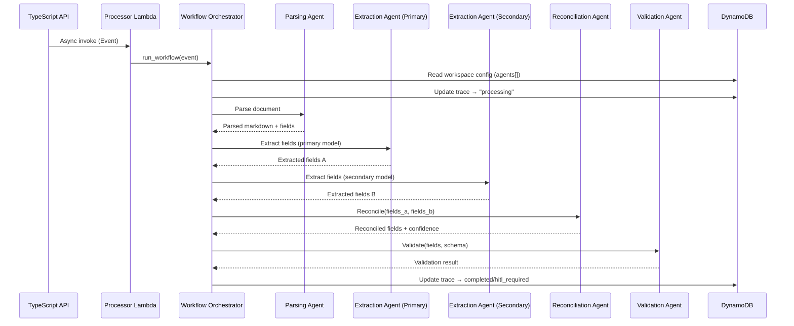

# Design Document: Strands Workflow Engine

## Overview

This design covers Phase 3 of the DocOps platform: replacing the Phase 2 linear processor with a multi-agent orchestration system built on the Strands Agents SDK. Each pipeline stage becomes a Strands agent with its own system prompt, tools, model configuration, and per-step telemetry. The existing Phase 2 service modules (docling_client, llm_reasoning, reconciliation, validation_service) are preserved as tool implementations wrapped by Strands agents.

The key architectural shift is from a hardcoded sequential pipeline to a configurable agent chain where:
- Each agent is a Strands `Agent` instance with a system prompt and tool functions
- The orchestrator reads the workspace's `agents[]` configuration to determine which agents run
- Dual-pipeline reconciliation runs extraction twice with different prompts/models
- Every agent step is recorded with input/output tokens, latency, model ID, and prompt version



## Architecture

### Module Structure

```
services/
├── workflow/
│   ├── __init__.py
│   ├── handler.py              # Lambda entry point (existing, updated)
│   ├── orchestrator.py         # NEW: Agent chain orchestrator
│   ├── agents/
│   │   ├── __init__.py
│   │   ├── parsing.py          # NEW: Parsing agent definition
│   │   ├── extraction.py       # NEW: Extraction agent definition
│   │   ├── validation.py       # NEW: Validation agent definition
│   │   └── reconciliation.py   # NEW: Reconciliation agent definition
│   ├── prompts/
│   │   ├── __init__.py         # NEW: Prompt registry
│   │   ├── parsing/
│   │   │   └── 1.0.0.txt       # Parsing agent system prompt v1.0.0
│   │   ├── extraction/
│   │   │   └── 1.0.0.txt       # Extraction agent system prompt v1.0.0
│   │   ├── validation/
│   │   │   └── 1.0.0.txt       # Validation agent system prompt v1.0.0
│   │   └── reconciliation/
│   │       └── 1.0.0.txt       # Reconciliation agent system prompt v1.0.0
│   ├── models.py               # NEW: Agent step and orchestrator data models
│   ├── runner.py               # Existing (deprecated, kept for rollback)
│   ├── state_machine.py        # Existing (reused by orchestrator)
│   ├── validation_service.py   # Existing (wrapped by Validation Agent)
│   └── requirements.txt        # Updated with strands-agents
├── processor/
│   ├── docling_client.py       # Existing (wrapped by Parsing Agent)
│   ├── llm_reasoning.py        # Existing (wrapped by Extraction Agent)
│   ├── reconciliation.py       # Existing (wrapped by Reconciliation Agent)
│   └── ...
└── models.py                   # Shared Pydantic models (existing)
```

### Deployment

The existing `ProcessingStack` CDK stack already provisions the Lambda with the correct handler path (`workflow.handler.handler`), Bedrock permissions for both Claude Haiku and Sonnet, and all required environment variables. Changes needed:

1. **requirements.txt**: Add `strands-agents` and `strands-agents-bedrock` dependencies
2. **CDK bundling command**: Already copies `workflow/` and `processor/` — the new `agents/` and `prompts/` subdirectories are included automatically
3. **No new IAM permissions needed**: Bedrock InvokeModel for Haiku and Sonnet is already granted

## Components and Interfaces

### 1. Workflow Orchestrator (`services/workflow/orchestrator.py`)

The central component that replaces `runner.py`. Reads workspace config, instantiates Strands agents, and executes them in sequence.

```python
class WorkflowOrchestrator:
    def __init__(self, event: ProcessingEvent, workspace: dict):
        """
        Initialize with the processing event and workspace configuration.
        Loads the agent chain from workspace.agents[] or uses the default chain.
        """

    def run(self) -> WorkflowResult:
        """
        Execute the agent chain. For each agent:
        1. Load prompt from Prompt_Registry
        2. Instantiate Strands Agent with model provider and tools
        3. Execute agent with input from previous agent
        4. Record Agent_Step with metrics
        5. Pass output to next agent
        Returns WorkflowResult with final status, fields, confidence, and agent_steps.
        """
```

Agent chain resolution:
- If `workspace.agents` is a list of strings: `["parsing", "extraction", "reconciliation", "validation"]`
- If `workspace.agents` is a list of objects: `[{"agent_name": "extraction", "model_id": "anthropic.claude-3-sonnet-..."}]`
- If empty/absent: default chain `["parsing", "extraction", "reconciliation", "validation"]`

Dual-pipeline logic:
- When `"reconciliation"` is in the chain, the orchestrator runs `"extraction"` twice before reconciliation
- First run uses the primary model (from agent config or `BEDROCK_MODEL_ID` env var)
- Second run uses `workspace.secondary_model_id` or a different prompt version
- Both extraction results are passed to the Reconciliation Agent

### 2. Agent Definitions (`services/workflow/agents/`)

Each agent module defines a factory function that creates a Strands `Agent` instance.

#### Parsing Agent (`agents/parsing.py`)

```python
from strands import Agent, tool
from processor.docling_client import parse_document

@tool
def parse_doc(file_bytes: bytes, filename: str) -> dict:
    """Parse a document using the Docling service. Returns markdown and extracted fields."""
    return parse_document(file_bytes, filename)

def create_parsing_agent(system_prompt: str, model_id: str | None = None) -> Agent:
    """Create a Parsing Agent with the Docling tool."""
    return Agent(
        system_prompt=system_prompt,
        tools=[parse_doc],
        model=_get_model_provider(model_id),
    )
```

#### Extraction Agent (`agents/extraction.py`)

```python
from strands import Agent, tool
from processor.llm_reasoning import extract_fields

@tool
def extract(parsed_text: str, schema: dict, prompt_version: str) -> dict:
    """Extract structured fields from parsed text using Bedrock LLM."""
    fields, input_tokens, output_tokens = extract_fields(parsed_text, schema, prompt_version)
    return {"fields": fields, "input_tokens": input_tokens, "output_tokens": output_tokens}

def create_extraction_agent(system_prompt: str, model_id: str | None = None) -> Agent:
    """Create an Extraction Agent with the LLM reasoning tool."""
    return Agent(
        system_prompt=system_prompt,
        tools=[extract],
        model=_get_model_provider(model_id),
    )
```

#### Validation Agent (`agents/validation.py`)

```python
from strands import Agent, tool
from workflow.validation_service import validate_output

@tool
def validate(extracted_fields: dict, schema: dict) -> dict:
    """Validate extracted fields against workspace schema."""
    result = validate_output(extracted_fields, schema)
    return {"valid": result.valid, "errors": [...], "coerced_fields": result.coerced_fields}

def create_validation_agent(system_prompt: str, model_id: str | None = None) -> Agent:
    """Create a Validation Agent with the schema validation tool."""
    return Agent(
        system_prompt=system_prompt,
        tools=[validate],
        model=_get_model_provider(model_id),
    )
```

#### Reconciliation Agent (`agents/reconciliation.py`)

```python
from strands import Agent, tool
from processor.reconciliation import reconcile

@tool
def reconcile_fields(primary_fields: dict, secondary_fields: dict, hitl_threshold: float) -> dict:
    """Compare two extraction outputs and produce reconciled results."""
    result = reconcile(primary_fields, secondary_fields, hitl_threshold)
    return result.model_dump()

def create_reconciliation_agent(system_prompt: str, model_id: str | None = None) -> Agent:
    """Create a Reconciliation Agent with the dual-pipeline comparison tool."""
    return Agent(
        system_prompt=system_prompt,
        tools=[reconcile_fields],
        model=_get_model_provider(model_id),
    )
```

#### Model Provider Helper

```python
from strands.models.bedrock import BedrockModel
import os

DEFAULT_MODEL_ID = os.environ.get("BEDROCK_MODEL_ID", "anthropic.claude-3-haiku-20240307-v1:0")

def _get_model_provider(model_id: str | None = None) -> BedrockModel:
    return BedrockModel(
        model_id=model_id or DEFAULT_MODEL_ID,
        region_name=os.environ.get("AWS_REGION_NAME", "us-east-1"),
    )
```

### 3. Prompt Registry (`services/workflow/prompts/__init__.py`)

Manages versioned prompt templates stored as text files in the `prompts/` directory.

```python
class PromptRegistry:
    def __init__(self, prompts_dir: str | None = None):
        """Initialize with path to prompts directory. Defaults to ./prompts/ relative to this file."""

    def get_prompt(self, agent_name: str, version: str) -> tuple[str, str]:
        """
        Load prompt template for the given agent and version.
        Returns (prompt_text, actual_version).
        If requested version doesn't exist, falls back to latest and logs warning.
        """

    def list_versions(self, agent_name: str) -> list[str]:
        """List available prompt versions for an agent, sorted by semver."""
```

Directory structure:
```
prompts/
├── parsing/
│   └── 1.0.0.txt
├── extraction/
│   ├── 1.0.0.txt
│   └── 1.1.0.txt
├── validation/
│   └── 1.0.0.txt
└── reconciliation/
    └── 1.0.0.txt
```

Version resolution: files are named `{version}.txt`. The registry scans the agent's directory, sorts versions using semver ordering, and returns the requested version or the latest if not found.

### 4. Agent Step Recording

The orchestrator wraps each agent execution with timing and metric collection:

```python
def _execute_agent(self, agent_name: str, agent: Agent, input_data: dict) -> tuple[dict, AgentStep]:
    start = time.time()
    step = AgentStep(
        agent_name=agent_name,
        model_id=agent.model.model_id if hasattr(agent, 'model') else "none",
        prompt_version=self._prompt_versions.get(agent_name, "unknown"),
    )
    try:
        result = agent(json.dumps(input_data))
        step.status = "success"
        step.output_summary = _summarize(result)
        # Extract token usage from Strands agent metrics
        if hasattr(result, 'metrics'):
            step.input_tokens = result.metrics.get('input_tokens', 0)
            step.output_tokens = result.metrics.get('output_tokens', 0)
    except Exception as e:
        step.status = "error"
        step.error_message = str(e)
        raise
    finally:
        step.latency_ms = round((time.time() - start) * 1000, 2)
    return result, step
```

### 5. Updated Handler (`services/workflow/handler.py`)

The existing handler is updated to use the orchestrator:

```python
def handler(event: dict, context: Any) -> dict:
    trace_id = event.get("trace_id")
    workspace_id = event.get("workspace_id")

    # Load workspace config for agent chain
    workspace = _load_workspace(workspace_id)

    processing_event = ProcessingEvent(**event)
    orchestrator = WorkflowOrchestrator(processing_event, workspace)
    result = orchestrator.run()

    return result.to_api_response()
```

## Data Models

### Processing Event (unchanged from Phase 2)

```python
class ProcessingEvent(BaseModel):
    trace_id: str
    workspace_id: str
    s3_key: str
    filename: str
    schema: dict[str, Any] = Field(default_factory=dict)
    hitl_threshold: float = 0.8
    prompt_version: str = "1.0.0"
```

### Agent Step Record

```python
class AgentStep(BaseModel):
    agent_name: str
    model_id: str = "none"
    prompt_version: str = "1.0.0"
    input_tokens: int = 0
    output_tokens: int = 0
    latency_ms: float = 0.0
    status: str = "success"  # "success" | "error"
    error_message: str | None = None
```

### Agent Chain Config (per workspace)

```python
class AgentConfig(BaseModel):
    agent_name: str
    model_id: str | None = None
    prompt_version: str | None = None

# workspace.agents can be:
# - list[str]: ["parsing", "extraction", "reconciliation", "validation"]
# - list[AgentConfig]: [{"agent_name": "extraction", "model_id": "..."}]
```

### Workflow Result

```python
class WorkflowResult(BaseModel):
    trace_id: str
    workspace_id: str
    status: str  # "completed" | "hitl_required" | "failed"
    workflow_state: str
    confidence: float = 0.0
    tokens: int = 0
    latency_ms: float = 0.0
    fields: list[dict] = Field(default_factory=list)
    agent_steps: list[AgentStep] = Field(default_factory=list)
    validation_errors: list[dict] = Field(default_factory=list)
    error: str | None = None

    def to_api_response(self) -> dict:
        """Return the same response shape as Phase 2 for backward compatibility."""
        return {
            "trace_id": self.trace_id,
            "workspace_id": self.workspace_id,
            "status": self.status,
            "workflow_state": self.workflow_state,
            "confidence": self.confidence,
            "tokens": self.tokens,
            "latency_ms": self.latency_ms,
            "fields": self.fields,
            "agent_steps": [s.model_dump() for s in self.agent_steps],
            "validation_errors": self.validation_errors,
        }
```

### Trace Record (DynamoDB — after Phase 3 processing)

The trace record gains a structured `agent_steps` array:

| Attribute | Type | Description |
|-----------|------|-------------|
| `agent_steps` | List[Map] | Array of AgentStep records, one per agent executed |
| `status` | String | `"completed"`, `"hitl_required"`, or `"failed"` |
| `workflow_state` | String | Final state from state machine |
| `fields` | List[Map] | Reconciled field results |
| `confidence` | Number | Overall confidence (0.0–1.0) |
| `tokens` | Number | Sum of all agent step tokens |
| `latency` | Number | Sum of all agent step latencies (ms) |
| `prompt_version` | String | Workspace-level prompt version |

Example `agent_steps` entry:
```json
{
  "agent_name": "extraction",
  "model_id": "anthropic.claude-3-haiku-20240307-v1:0",
  "prompt_version": "1.0.0",
  "input_tokens": 1250,
  "output_tokens": 340,
  "latency_ms": 2340.5,
  "status": "success"
}
```

### Workspace Model Updates

The `Workspace` model's `agents` field evolves from `list[str]` to support both simple and detailed configurations:

```python
# Simple: ["parsing", "extraction", "reconciliation", "validation"]
# Detailed: [{"agent_name": "extraction", "model_id": "anthropic.claude-3-sonnet-..."}]
```

New optional field on Workspace:
- `secondary_model_id: str | None` — model ID for the second extraction run in dual-pipeline mode

</text>
</invoke>


## Correctness Properties

*A property is a characteristic or behavior that should hold true across all valid executions of a system — essentially, a formal statement about what the system should do.*

### Property 1: Agent chain from workspace config determines execution order

*For any* workspace with a non-empty `agents` field, the orchestrator should execute exactly those agents in the specified order, and the resulting `agent_steps` array on the trace should contain entries matching the agent names in the same order.

**Validates: Requirements 2.1, 2.3, 4.1, 4.2**

### Property 2: Default agent chain is used when workspace agents is empty

*For any* workspace with an empty or absent `agents` field, the orchestrator should execute the default chain (parsing, extraction, reconciliation, validation) and the resulting `agent_steps` array should contain exactly four entries with those agent names.

**Validates: Requirements 2.2**

### Property 3: Agent step records contain all required fields

*For any* completed agent execution (success or failure), the recorded AgentStep should contain non-empty agent_name, a model_id string, a prompt_version string, non-negative input_tokens and output_tokens, a positive latency_ms, and a status of either "success" or "error".

**Validates: Requirements 4.2, 4.3, 4.4, 4.5, 4.6, 4.7**

### Property 4: Total tokens equals sum of agent step tokens

*For any* completed workflow (all agents finished), the total tokens stored on the trace should equal the sum of (input_tokens + output_tokens) across all AgentStep records.

**Validates: Requirements 4.9**

### Property 5: Total latency equals sum of agent step latencies

*For any* completed workflow, the total latency stored on the trace should equal the sum of latency_ms across all AgentStep records (within floating-point tolerance).

**Validates: Requirements 4.10**

### Property 6: Dual-pipeline runs extraction twice when reconciliation is in chain

*For any* agent chain that includes "reconciliation", the orchestrator should execute the extraction agent exactly twice (once with primary config, once with secondary config) before executing the reconciliation agent. The agent_steps array should contain two extraction entries.

**Validates: Requirements 3.1**

### Property 7: Reconciliation confidence rules are consistent

*For any* pair of extraction results, when both agree on a field value the confidence should be 1.0, when they disagree the confidence should be reduced, and when only one has a value the confidence should be 0.7.

**Validates: Requirements 3.3, 3.4, 3.5**

### Property 8: Prompt registry falls back to latest version

*For any* agent name with at least one registered prompt version, requesting a non-existent version should return the latest available version (by semver ordering) and the returned actual_version should differ from the requested version.

**Validates: Requirements 5.2, 5.3**

### Property 9: Prompt version in agent step matches actual version used

*For any* agent execution, the prompt_version recorded in the AgentStep should match the actual_version returned by the Prompt_Registry (which may differ from the requested version if fallback occurred).

**Validates: Requirements 5.4**

### Property 10: Agent failure stops chain and preserves prior steps

*For any* agent chain where agent N fails, the orchestrator should: (a) not execute agents N+1 through end, (b) preserve all AgentStep records from agents 0 through N (including the failed step), and (c) transition the workflow to the failed state.

**Validates: Requirements 2.5, 7.1, 7.3**

### Property 11: Workflow result maintains backward compatibility with Phase 2

*For any* completed workflow, the `to_api_response()` output should contain all keys present in the Phase 2 response: trace_id, workspace_id, status, confidence, tokens, latency_ms, fields. The status should be one of "completed", "hitl_required", or "failed".

**Validates: Requirements 6.4**

### Property 12: Secondary extraction failure degrades gracefully

*For any* dual-pipeline execution where the secondary extraction fails, the reconciliation should proceed with only primary results and the overall confidence should be reduced by 0.1 compared to what it would be with only primary results at full confidence.

**Validates: Requirements 3.6**

## Error Handling

### Error Categories

| Error Type | Source | Trace Status | Agent Step Status | Error Message Pattern |
|-----------|--------|-------------|-------------------|----------------------|
| Agent init failure | Invalid model ID or prompt | `"failed"` | `"error"` | `"Failed to initialize {agent_name}: {error}"` |
| Parsing agent error | Docling service failure | `"failed"` | `"error"` | `"Parsing agent failed: {docling_error}"` |
| Extraction agent error | Bedrock API failure | `"failed"` | `"error"` | `"Extraction agent failed: {bedrock_error}"` |
| Secondary extraction error | Bedrock API failure (2nd run) | continues | `"error"` | `"Secondary extraction failed: {error}"` (graceful degradation) |
| Validation agent error | Schema validation crash | `"failed"` | `"error"` | `"Validation agent failed: {error}"` |
| Reconciliation agent error | Reconcile function crash | `"failed"` | `"error"` | `"Reconciliation agent failed: {error}"` |
| Prompt not found | Missing prompt file | `"failed"` | `"error"` | `"Prompt not found for {agent_name} v{version}"` |
| Workspace load failure | DynamoDB read error | `"failed"` | N/A | `"Failed to load workspace {workspace_id}: {error}"` |
| Trace update failure | DynamoDB write error | logged | N/A | `"Failed to update trace {trace_id}: {error}"` |

### Error Handling Strategy

```python
def run(self) -> WorkflowResult:
    try:
        workspace = self._load_workspace()
        chain = self._resolve_chain(workspace)

        for agent_config in chain:
            agent, prompt_version = self._init_agent(agent_config)
            output, step = self._execute_agent(agent_config.agent_name, agent, current_input)
            self.agent_steps.append(step)
            current_input = output

    except AgentInitError as e:
        self._fail_trace(str(e))
    except AgentExecutionError as e:
        # Step already recorded in _execute_agent
        self._fail_trace(str(e))
    except Exception as e:
        try:
            self._fail_trace(f"Unexpected error: {e}")
        except Exception as update_err:
            logger.error("Original error: %s", e)
            logger.error("Trace update failed: %s", update_err)
```

Key principles:
- Each agent execution is wrapped in timing/metric collection regardless of success or failure
- Failed agent steps are still appended to agent_steps before the chain stops
- Prior successful agent steps are always preserved on the trace
- Secondary extraction failure in dual-pipeline is a special case: it doesn't fail the whole workflow

## Testing Strategy

### Property-Based Testing

Property-based tests use `hypothesis` to verify universal properties across randomly generated inputs.

Properties to implement as PBT:
- **Property 1**: Generate random agent chain configs, verify execution order matches agent_steps order
- **Property 2**: Generate random workspaces with empty agents, verify default chain is used
- **Property 3**: Generate random agent execution results (success/failure), verify AgentStep has all required fields
- **Property 4**: Generate random lists of AgentSteps with token counts, verify total equals sum
- **Property 5**: Generate random lists of AgentSteps with latencies, verify total equals sum
- **Property 7**: Generate random pairs of field dicts, verify reconciliation confidence rules
- **Property 8**: Generate random version strings and registered versions, verify fallback behavior
- **Property 10**: Generate random chain lengths and failure positions, verify prior steps preserved
- **Property 11**: Generate random WorkflowResults, verify to_api_response() contains all required keys
- **Property 12**: Generate random primary extraction results, verify confidence reduction on secondary failure

### Unit Testing

Unit tests cover specific examples, edge cases, and integration points:

- **Edge cases**:
  - Workspace with no agents field → default chain used
  - Workspace with mixed string/object agent configs → both formats parsed correctly
  - Prompt version not found → fallback to latest with warning logged
  - All agents succeed with zero-field schema → confidence 1.0, status completed
  - First agent in chain fails → only one agent_step recorded, trace failed
  - Secondary extraction timeout → reconciliation proceeds with primary only

- **Integration tests** (mocked AWS services):
  - Full default chain execution with mocked Docling, Bedrock, DynamoDB
  - Dual-pipeline execution with two different model IDs
  - Workspace config with custom agent chain (subset of agents)
  - Agent step recording persisted to DynamoDB trace

### Test Organization

```
tests/
├── test_orchestrator.py        # Orchestrator chain execution tests
├── test_agents/
│   ├── test_parsing_agent.py   # Parsing agent unit tests
│   ├── test_extraction_agent.py # Extraction agent unit tests
│   ├── test_validation_agent.py # Validation agent unit tests
│   └── test_reconciliation_agent.py # Reconciliation agent unit tests
├── test_prompt_registry.py     # Prompt versioning tests
├── test_agent_step.py          # Agent step recording tests (property + unit)
├── test_dual_pipeline.py       # Dual-pipeline reconciliation tests
└── test_backward_compat.py     # Phase 2 response compatibility tests
```

### Dependencies

- `hypothesis` — property-based testing
- `pytest` — test runner
- `moto` — AWS service mocking (DynamoDB, Bedrock, S3)
- `unittest.mock` — Strands SDK mocking
