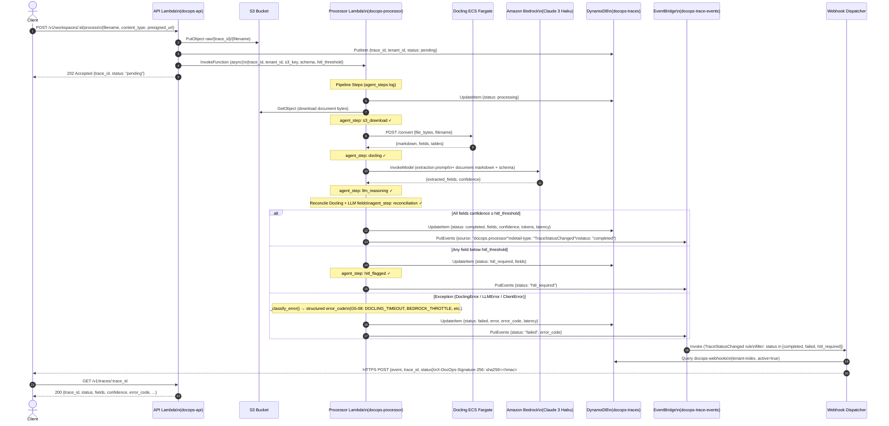
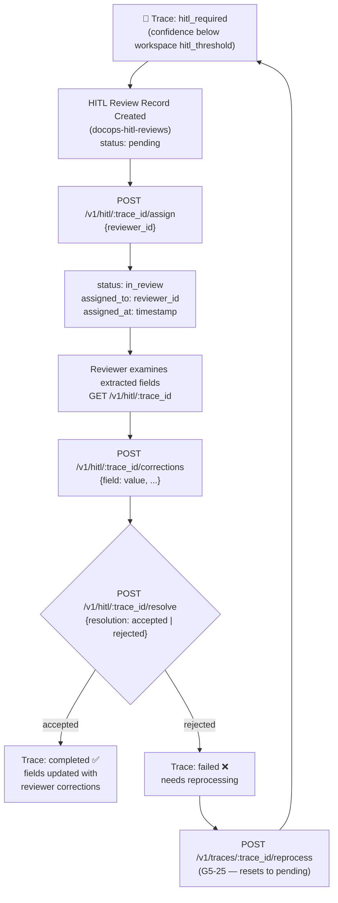
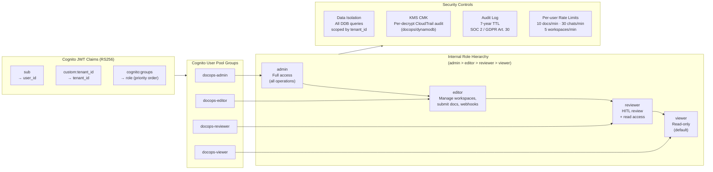
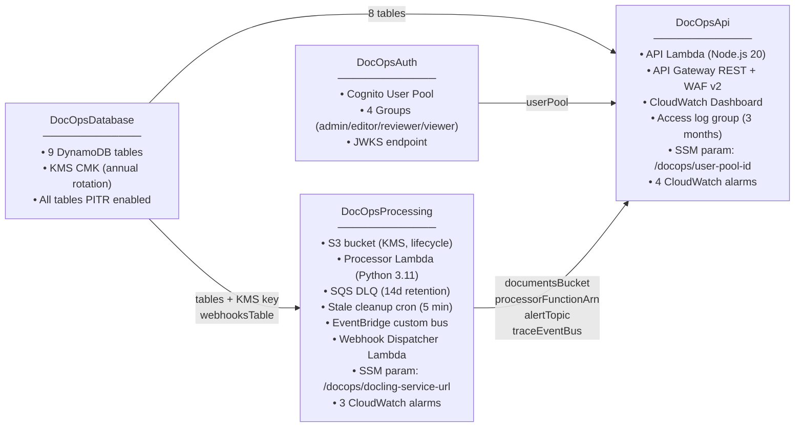
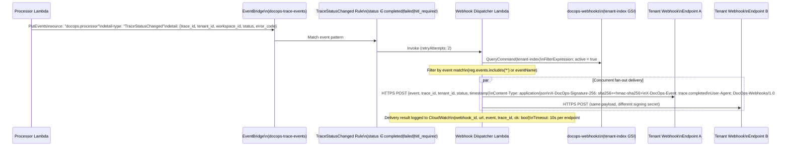

# DocOps — Agentic Document Intelligence Platform

> **Production-grade GA** · Multi-tenant · Serverless on AWS · Claude 3 Haiku/Sonnet · Docling ECS

DocOps is an end-to-end document intelligence platform that extracts, reconciles, and reviews structured data from any document format (PDF, DOCX, images). It combines Docling layout parsing with LLM reasoning via Amazon Bedrock, and routes uncertain extractions to a Human-in-the-Loop (HITL) review queue.

---

## Architecture Overview

### G5-30: High-Level System Architecture

```mermaid
graph TB
    subgraph Client["Client Layer"]
        WEB["Web App\n(React / Amplify)"]
        SDK["API Clients\n(SDK / REST)"]
    end

    subgraph AWS_Edge["AWS Edge"]
        WAF["WAF v2\n(Rate limit + OWASP rules)"]
        APIGW["API Gateway\n(REST, v1 stage)\nAccess logging + X-Ray"]
    end

    subgraph API_Layer["API Layer — DocOpsApi Stack"]
        LAMBDA_API["API Lambda\n(Node.js 20, 512 MB)\ndocops-api\nX-Ray active tracing"]
        CW_DASH["CloudWatch Dashboard\n(DocOps-Operations)"]
        ACCESS_LOGS["Access Log Group\n/docops/api-gateway/access-logs"]
    end

    subgraph Auth["Auth — DocOpsAuth Stack"]
        COGNITO["Cognito User Pool\n+ Groups (admin/editor/reviewer/viewer)"]
        JWKS["JWKS Endpoint\n(JWT RS256 validation)"]
    end

    subgraph Processing["Processing — DocOpsProcessing Stack"]
        LAMBDA_PROC["Processor Lambda\n(Python 3.11, 1024 MB)\ndocops-processor\nX-Ray active tracing"]
        LAMBDA_CLEANUP["Stale Cleanup Lambda\n(Node.js 20)\nEvery 5 min cron"]
        LAMBDA_WEBHOOK["Webhook Dispatcher Lambda\n(Node.js 20)\nFan-out to tenant URLs"]
        S3["S3 Documents Bucket\n(KMS encrypted\nbucketKey, 30-day lifecycle)"]
        DLQ["SQS DLQ\n(docops-processor-dlq\n14-day retention)"]
        EB_CRON["EventBridge Rule\n(stale trace cron)"]
        EB_TRACE["EventBridge Custom Bus\n(docops-trace-events)"]
        SNS["SNS Alert Topic\n(docops-ops-alerts)"]
    end

    subgraph AI["AI Services"]
        DOCLING["Docling ECS Fargate\n(us-east-1, account 098493093308)\nLayout parsing — PDF, DOCX, images"]
        BEDROCK["Amazon Bedrock\nClaude 3 Haiku / Sonnet\nField extraction + Chat"]
    end

    subgraph Database["Database — DocOpsDatabase Stack"]
        DDB_TENANTS["docops-tenants\n(email-index GSI)"]
        DDB_WS["docops-workspaces\n(tenant-index GSI)"]
        DDB_TRACES["docops-traces\n(workspace-index, tenant-index GSIs)"]
        DDB_SESSIONS["docops-sessions\n(workspace-index GSI, TTL 30d)"]
        DDB_HITL["docops-hitl-reviews\n(status, tenant, workspace GSIs)"]
        DDB_USAGE["docops-usage\ndocops-usage-events (billing-period GSI)"]
        DDB_AUDIT["docops-audit-log\n(action-index GSI, 7-year TTL)\nSOC 2 / GDPR Article 30"]
        DDB_WEBHOOKS["docops-webhooks\n(tenant-index GSI)"]
        KMS["KMS CMK\nalias: docops/dynamodb\nAnnual auto-rotation"]
    end

    subgraph Config["SSM Parameter Store"]
        SSM_URL["/docops/docling-service-url"]
        SSM_POOL["/docops/user-pool-id"]
    end

    WEB & SDK --> WAF --> APIGW --> LAMBDA_API
    LAMBDA_API --> COGNITO & JWKS
    LAMBDA_API --> DDB_TENANTS & DDB_WS & DDB_TRACES & DDB_SESSIONS & DDB_HITL & DDB_USAGE & DDB_AUDIT & DDB_WEBHOOKS
    LAMBDA_API --> S3
    LAMBDA_API -->|"async invoke"| LAMBDA_PROC
    LAMBDA_API --> BEDROCK
    LAMBDA_API --> SSM_POOL
    LAMBDA_PROC --> S3
    LAMBDA_PROC --> DOCLING
    LAMBDA_PROC --> BEDROCK
    LAMBDA_PROC --> DDB_TRACES
    LAMBDA_PROC -->|"TraceStatusChanged"| EB_TRACE
    LAMBDA_PROC -.->|"async failure"| DLQ
    LAMBDA_PROC --> SSM_URL
    EB_TRACE -->|"completed/failed/hitl_required"| LAMBDA_WEBHOOK
    LAMBDA_WEBHOOK --> DDB_WEBHOOKS
    LAMBDA_WEBHOOK -->|"HTTPS POST\nHMAC-SHA256 signed"| EXT_WEBHOOK["Tenant Webhook\nEndpoints (external)"]
    EB_CRON -->|"every 5 min"| LAMBDA_CLEANUP
    LAMBDA_CLEANUP --> DDB_TRACES
    DDB_TENANTS & DDB_WS & DDB_TRACES & DDB_SESSIONS & DDB_HITL & DDB_USAGE & DDB_AUDIT & DDB_WEBHOOKS --> KMS
    APIGW --> ACCESS_LOGS
    APIGW & LAMBDA_API & LAMBDA_PROC --> XRAY["AWS X-Ray\nDistributed Tracing"]
    SNS -->|"alarm notifications"| OPS["Ops Team\n(email / PagerDuty)"]
```



---

### Document Processing Pipeline (Sequence)



---

### HITL Review Workflow



---

### Multi-Tenant Security & RBAC Model



---

### CDK Stack Dependency Graph



---

### Webhook Delivery Architecture (G5-12)



---

## API Endpoints

| Method | Path | Description | Min Role |
|--------|------|-------------|----------|
| `GET` | `/v1/health` | Liveness check | — |
| `GET` | `/v1/health/ready` | Deep readiness (DynamoDB + S3 + Bedrock) | — |
| `POST` | `/v1/workspaces` | Create workspace | editor |
| `GET` | `/v1/workspaces` | List workspaces | viewer |
| `GET` | `/v1/workspaces/:id` | Get workspace | viewer |
| `PUT` | `/v1/workspaces/:id` | Update workspace | editor |
| `DELETE` | `/v1/workspaces/:id` | Delete workspace | editor |
| `POST` | `/v1/workspaces/:id/process` | Submit single document | editor |
| `POST` | `/v1/workspaces/:id/process/batch` | Submit batch (≤20 docs) | editor |
| `GET` | `/v1/workspaces/:id/traces` | List traces (paginated) | viewer |
| `GET` | `/v1/traces/:trace_id` | Get trace detail | viewer |
| `POST` | `/v1/traces/:trace_id/reprocess` | Re-process failed/completed trace | editor |
| `GET` | `/v1/hitl` | List HITL reviews | reviewer |
| `GET` | `/v1/hitl/:trace_id` | Get review detail | reviewer |
| `POST` | `/v1/hitl/:trace_id/assign` | Assign review to reviewer | reviewer |
| `POST` | `/v1/hitl/:trace_id/corrections` | Submit field corrections | reviewer |
| `POST` | `/v1/hitl/:trace_id/resolve` | Resolve review (accepted/rejected) | reviewer |
| `POST` | `/v1/workspaces/:id/sessions` | Create chat session | viewer |
| `GET` | `/v1/workspaces/:id/sessions` | List sessions | viewer |
| `GET` | `/v1/sessions/:id` | Get session | viewer |
| `DELETE` | `/v1/sessions/:id` | Delete session | viewer |
| `POST` | `/v1/sessions/:id/chat` | Send chat message | viewer |
| `GET` | `/v1/observability` | Dashboard metrics | admin |
| `GET` | `/v1/observability/traces` | Trace metrics (paginated, next_token) | admin |
| `GET` | `/v1/observability/agents` | Agent step metrics | admin |
| `GET` | `/v1/observability/usage` | Usage summary | admin |
| `GET` | `/v1/tenant/plan` | Get current billing plan | viewer |
| `POST` | `/v1/tenant/plan` | Change billing plan | admin |
| `GET` | `/v1/tenant/usage/export` | Export usage CSV | admin |
| `GET` | `/v1/tenant/export` | GDPR full data export (DSAR) | admin |
| `DELETE` | `/v1/tenant` | GDPR tenant soft-delete | admin |
| `POST` | `/v1/tenant/webhooks` | Register HTTPS webhook endpoint | editor |
| `GET` | `/v1/tenant/webhooks` | List registered webhooks | viewer |
| `DELETE` | `/v1/tenant/webhooks/:id` | Deregister webhook | editor |

Full machine-readable specification: [`api/openapi.yaml`](api/openapi.yaml)

---

## Prerequisites

| Tool | Version | Install |
|------|---------|---------|
| Node.js | 20 LTS | `nvm install 20` |
| Python | 3.11 | `pyenv install 3.11` |
| AWS CDK | 2.x | `npm i -g aws-cdk` |
| AWS CLI | 2.x | [AWS docs](https://docs.aws.amazon.com/cli/latest/userguide/install-cliv2.html) |
| Docker | 24+ | Required for CDK asset bundling |

**AWS account permissions required:**
- `AdministratorAccess` (for first deployment) or a scoped deploy role with CloudFormation, Lambda, API Gateway, DynamoDB, S3, Cognito, SQS, SNS, CloudWatch, WAFv2, KMS, SSM, EventBridge permissions.

---

## Environment Variables

### CDK / Deployment

| Variable | Description | Example |
|----------|-------------|---------|
| `CDK_DEFAULT_ACCOUNT` | AWS account ID | `098493093308` |
| `CDK_DEFAULT_REGION` | AWS region | `us-east-1` |
| `DOCLING_SERVICE_URL` | Docling ECS service URL | `http://docling.internal:5001` |

### API Lambda (set via CDK environment block — no `.env` needed)

| Variable | Source | Description |
|----------|--------|-------------|
| `TENANTS_TABLE` | CDK output | DynamoDB tenants table name |
| `WORKSPACES_TABLE` | CDK output | DynamoDB workspaces table |
| `TRACES_TABLE` | CDK output | DynamoDB traces table |
| `SESSIONS_TABLE` | CDK output | DynamoDB sessions table |
| `HITL_REVIEWS_TABLE` | CDK output | DynamoDB HITL reviews table |
| `USAGE_TABLE` | CDK output | DynamoDB usage counters table |
| `USAGE_EVENTS_TABLE` | CDK output | DynamoDB usage events log |
| `AUDIT_TABLE` | CDK output | DynamoDB audit log table |
| `WEBHOOKS_TABLE` | CDK output | DynamoDB webhook registrations table |
| `USER_POOL_ID` | SSM `/docops/user-pool-id` | Cognito User Pool ID |
| `DOCUMENTS_BUCKET` | CDK output | S3 bucket for document uploads |
| `PROCESSOR_FUNCTION_ARN` | CDK output | Processor Lambda ARN |
| `BEDROCK_MODEL_ID` | Hardcoded | `anthropic.claude-3-haiku-20240307-v1:0` |

### Processor Lambda

| Variable | Source | Description |
|----------|--------|-------------|
| `TRACES_TABLE` | CDK output | DynamoDB traces table name |
| `WORKSPACES_TABLE` | CDK output | DynamoDB workspaces table |
| `DOCUMENTS_BUCKET` | CDK output | S3 bucket for uploads |
| `DOCLING_SERVICE_URL` | SSM `/docops/docling-service-url` | Docling ECS endpoint |
| `BEDROCK_MODEL_ID` | Hardcoded | Claude 3 Haiku model ID |
| `TRACE_EVENT_BUS_NAME` | CDK output | EventBridge custom bus name |

### GitHub Actions Secrets (required for CI/CD)

| Secret | Description |
|--------|-------------|
| `AWS_DEPLOY_ROLE_ARN` | IAM role ARN for OIDC-based deployment |
| `AWS_ACCOUNT_ID` | AWS account ID |
| `DOCLING_SERVICE_URL` | Docling ECS service endpoint |

---

## First Deploy (New Environment)

```bash
# 1. Clone and install
git clone https://github.com/your-org/inteldoc-view.git
cd inteldoc-view

# 2. Install all dependencies
(cd api && npm ci)
(cd ui && npm ci)
(cd infra && npm ci)

# 3. Build the API Lambda
(cd api && npm run build)

# 4. Configure AWS credentials
export AWS_PROFILE=docops-deploy
# or: aws configure

# 5. Bootstrap CDK (first time only per account/region)
cd infra
npx cdk bootstrap aws://YOUR_ACCOUNT_ID/us-east-1

# 6. Deploy all stacks in dependency order
export DOCLING_SERVICE_URL="http://your-docling-ecs-endpoint:5001"

npx cdk deploy DocOpsDatabase --require-approval never
npx cdk deploy DocOpsAuth --require-approval never
npx cdk deploy DocOpsProcessing --require-approval never
npx cdk deploy DocOpsApi --require-approval never

# Or deploy all at once:
npx cdk deploy --all --require-approval never
```

---

## Incremental Deployment (Code Changes)

```bash
# API Lambda changes only
(cd api && npm run build)
(cd infra && npx cdk deploy DocOpsApi --require-approval never)

# Processor Lambda changes only
(cd infra && npx cdk deploy DocOpsProcessing --require-approval never)

# Infrastructure-only changes (no code changes)
(cd infra && npx cdk deploy --all --require-approval never)

# UI changes (deploy to Vercel or your hosting platform)
(cd ui && npm run build && npm run export)
```

---

## CDK Stack Outputs

After deployment, CDK outputs the following values:

```
DocOpsDatabase.TenantsTableName         = docops-tenants
DocOpsDatabase.WorkspacesTableName      = docops-workspaces
DocOpsDatabase.TracesTableName          = docops-traces
DocOpsDatabase.SessionsTableName        = docops-sessions
DocOpsDatabase.HitlReviewsTableName     = docops-hitl-reviews
DocOpsDatabase.UsageTableName           = docops-usage
DocOpsDatabase.UsageEventsTableName     = docops-usage-events
DocOpsDatabase.AuditLogTableName        = docops-audit-log
DocOpsDatabase.WebhooksTableName        = docops-webhooks
DocOpsDatabase.DynamoEncryptionKeyArn   = arn:aws:kms:...

DocOpsProcessing.DocumentsBucketName    = docops-documents-{account}-{region}
DocOpsProcessing.ProcessorFunctionArn   = arn:aws:lambda:...
DocOpsProcessing.ProcessorDlqUrl        = https://sqs...
DocOpsProcessing.AlertTopicArn          = arn:aws:sns:...
DocOpsProcessing.TraceEventBusArn       = arn:aws:events:...
DocOpsProcessing.WebhookDispatcherArn   = arn:aws:lambda:...
DocOpsProcessing.DoclingUrlParamName    = /docops/docling-service-url

DocOpsApi.ApiEndpointUrl                = https://{id}.execute-api.us-east-1.amazonaws.com/v1/
DocOpsApi.ApiLambdaArn                  = arn:aws:lambda:...
DocOpsApi.WebAclArn                     = arn:aws:wafv2:...
DocOpsApi.AccessLogGroupName            = /docops/api-gateway/access-logs
DocOpsApi.DashboardName                 = DocOps-Operations
```

---

## Post-Deployment Verification

```bash
API_URL="https://your-api-id.execute-api.us-east-1.amazonaws.com/v1"

# Liveness check
curl -s "$API_URL/health" | jq .
# Expected: {"status":"ok","timestamp":"...","version":"1.0.0"}

# Deep readiness check (DynamoDB + S3 + Bedrock)
curl -s "$API_URL/health/ready" | jq .
# Expected: {"status":"ready","checks":{"dynamodb":"ok","s3":"ok","bedrock":"reachable"}}
```

---

## Security

| Control | Implementation |
|---------|---------------|
| **Authentication** | Cognito JWT (RS256), JWKS validation on every request |
| **RBAC** | 4-tier role hierarchy via Cognito Groups: admin → editor → reviewer → viewer |
| **Encryption at rest** | All DynamoDB tables + S3 bucket: KMS CMK `docops/dynamodb`, annual rotation |
| **Encryption in transit** | TLS 1.2+ at API Gateway; HTTPS enforced for webhook delivery endpoints |
| **WAF** | AWS Managed Rules (CRS + KnownBadInputs) + IP rate limit (2000 req/5min) |
| **Tenant isolation** | All DynamoDB queries scoped by `tenant_id`; `tenant-index` GSI for cross-workspace queries |
| **Audit logging** | All mutations logged to `docops-audit-log` (7-year TTL, SOC 2 / GDPR Article 30) |
| **X-Ray tracing** | Active tracing on API Lambda, Processor Lambda, Stale Cleanup Lambda, Webhook Dispatcher |
| **Webhook signing** | HMAC-SHA256 per-tenant signing secret; `X-DocOps-Signature-256: sha256=<hex>` |
| **Per-user rate limits** | DynamoDB atomic counter: 10 docs/min, 30 chats/min, 5 workspaces/min |
| **SSM Parameter Store** | Docling URL + User Pool ID stored in SSM for auditability and rotation without redeploy |

---

## Monitoring & Alerts

All CloudWatch Alarms route to the **`docops-ops-alerts`** SNS topic.

**To subscribe an email:**
```bash
aws sns subscribe \
  --topic-arn $(aws sns list-topics --query "Topics[?contains(TopicArn,'docops-ops-alerts')].TopicArn" --output text) \
  --protocol email \
  --notification-endpoint ops@your-company.com
```

**Key Alarms:**

| Alarm | Threshold | Action |
|-------|-----------|--------|
| `docops-api-errors` | ≥10 errors/5min | Check API Lambda logs |
| `docops-api-throttles` | ≥20 throttles/5min | Raise reserved concurrency |
| `docops-apigw-5xx` | ≥5% rate/5min | Investigate Lambda errors |
| `docops-api-latency-p99` | >10s/5min | Investigate slow paths |
| `docops-processor-errors` | ≥5 errors/5min | Check Processor Lambda logs |
| `docops-processor-dlq-depth` | ≥1 message | Investigate failed events |
| `docops-processor-throttles` | ≥10 throttles/5min | Raise processor concurrency |

**CloudWatch Dashboard:** `DocOps-Operations` — API Lambda invocations/errors/throttles, duration p50/p99, API Gateway 4xx/5xx, latency, alarm status widget.

---

## Rollback Procedures

### Lambda rollback (immediate)
```bash
# List recent versions
aws lambda list-versions-by-function --function-name docops-api --query 'Versions[-5:].Version'

# Rollback to previous version using an alias
aws lambda update-alias \
  --function-name docops-api \
  --name live \
  --function-version PREVIOUS_VERSION
```

### CDK stack rollback
```bash
# CloudFormation will auto-rollback on deploy failure.
# To manually rollback:
aws cloudformation rollback-stack --stack-name DocOpsApi

# Check rollback status:
aws cloudformation describe-stacks --stack-name DocOpsApi \
  --query 'Stacks[0].StackStatus'
```

### DynamoDB point-in-time recovery
All tables have PITR enabled. To restore:
```bash
aws dynamodb restore-table-to-point-in-time \
  --source-table-name docops-traces \
  --target-table-name docops-traces-restored \
  --restore-date-time "2024-01-15T12:00:00Z"
```

---

## Docling ECS Service

Docling runs as a separate ECS Fargate service (account `098493093308`, region `us-east-1`). To check status:
```bash
aws ecs list-tasks --cluster docops-cluster --service-name docling
aws ecs describe-tasks --cluster docops-cluster --tasks TASK_ARN
```

Update the Docling service URL (SSM rotation — no Lambda redeploy needed):
```bash
aws ssm put-parameter \
  --name /docops/docling-service-url \
  --value "http://new-docling-endpoint:5001" \
  --overwrite
```

Or via CDK context (recreates SSM parameter):
```bash
cd infra
npx cdk deploy DocOpsProcessing \
  --context doclingServiceUrl=http://new-docling-endpoint:5001 \
  --require-approval never
```

---

## Local Development

```bash
# Start the UI dev server
cd ui && npm run dev
# → http://localhost:3000

# Run processor unit tests
cd services/processor && python -m pytest tests/ -v

# View OpenAPI spec with Swagger UI
npx @redocly/cli preview-docs api/openapi.yaml

# API local testing
cd api && npm run build && node -e "
  process.env.TENANTS_TABLE = 'docops-tenants';
  // ... set other env vars
  const { handler } = require('./dist/handler');
  handler({ httpMethod: 'GET', path: '/v1/health', headers: {}, pathParameters: {} })
    .then(r => console.log(r));
"
```

---

## Project Structure

```
inteldoc-view/
├── api/                        # Node.js TypeScript Lambda API
│   ├── openapi.yaml            # OpenAPI 3.1 specification (G5-02)
│   ├── src/
│   │   ├── handler.ts          # Lambda entry point + security headers
│   │   ├── router.ts           # Route dispatch (33 endpoints)
│   │   ├── handlers/
│   │   │   ├── health.ts       # Liveness + deep readiness (G5-10)
│   │   │   ├── workspace.ts    # Workspace CRUD
│   │   │   ├── process.ts      # Single document upload
│   │   │   ├── process-batch.ts # Batch upload (≤20 docs) (G5-13)
│   │   │   ├── traces.ts       # Trace read + list
│   │   │   ├── reprocess.ts    # Re-process failed traces (G5-25)
│   │   │   ├── hitl.ts         # HITL review workflow
│   │   │   ├── sessions.ts     # Chat session management
│   │   │   ├── chat.ts         # Bedrock chat completion
│   │   │   ├── observability.ts # Metrics + paginated traces (G5-21)
│   │   │   ├── billing.ts      # Plan management + usage export
│   │   │   ├── gdpr.ts         # GDPR delete + data export (G5-05)
│   │   │   └── webhooks.ts     # Webhook registration management (G5-12)
│   │   ├── middleware/
│   │   │   ├── auth.ts         # JWT validation + RBAC (G5-14)
│   │   │   ├── plan-enforcer.ts # Plan + per-user rate limits (G5-18)
│   │   │   └── tenant-resolver.ts
│   │   └── lib/
│   │       ├── dynamo.ts       # DynamoDB client helpers
│   │       ├── audit-logger.ts # Audit log (G5-23)
│   │       └── ...
│   └── dist/                   # Compiled output (gitignored)
├── infra/                      # AWS CDK infrastructure (TypeScript)
│   ├── bin/app.ts              # Stack wiring
│   └── lib/
│       ├── database-stack.ts   # 9 DynamoDB tables + KMS (G5-09, G5-23)
│       ├── auth-stack.ts       # Cognito User Pool + 4 Groups (G5-14)
│       ├── processing-stack.ts # S3, Processor Lambda, EventBridge, Webhooks (G5-12, G5-28)
│       └── api-stack.ts        # API Lambda, API GW, WAF, Dashboard (G5-01, G5-16, G5-29)
├── services/
│   └── processor/              # Python 3.11 document processing Lambda
│       ├── handler.py          # Pipeline: S3 → Docling → Bedrock → Reconcile → EventBridge
│       ├── docling_client.py   # Docling HTTP client (with retry + backoff)
│       ├── llm_reasoning.py    # Bedrock field extraction (Claude 3 Haiku)
│       ├── reconciliation.py   # Field reconciliation + HITL confidence scoring
│       ├── models.py           # Pydantic models + ErrorCode enum (G5-08)
│       └── tests/              # Unit tests: models, _classify_error, reconcile (G5-03)
├── ui/                         # Next.js 14 frontend
│   └── src/app/                # App Router pages
└── .github/
    └── workflows/
        ├── ci.yml              # PR validation
        └── deploy.yml          # Production deployment
```

---

## Phase Roadmap

| Phase | Status | Key Deliverables |
|-------|--------|-----------------|
| Phase 1 | ✅ Complete | Core API scaffold, DynamoDB tables, Cognito auth, workspace CRUD |
| Phase 2 | ✅ Complete | Document processing pipeline (Docling + Bedrock), HITL workflow, reconciliation |
| Phase 3 | ✅ Complete | Chat sessions (Bedrock), observability dashboard, billing plans, plan enforcement |
| Phase 4 | ✅ Complete | WAF v2, SQS DLQ, SNS alarms, stale trace cleanup, per-workspace rate limiting |
| Phase 5 | ✅ Complete | KMS encryption (G5-09), RBAC (G5-14), bulk upload (G5-13), webhooks + EventBridge (G5-12), audit log (G5-23), OpenAPI 3.1 (G5-02), X-Ray tracing (G5-01), SSM (G5-11), CloudWatch dashboard (G5-16), access logging (G5-29), per-user rate limiting (G5-18), processor unit tests (G5-03), GDPR (G5-05), structured error codes (G5-08), trace reprocess (G5-25), deep health check (G5-10), observability pagination (G5-21), tenant_id isolation (G5-19) |
